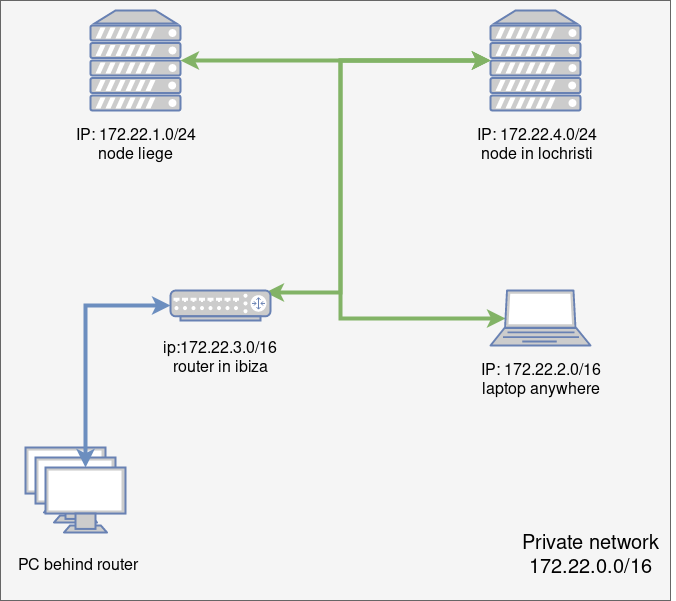

# Create private overlay network

The first thing to do when you want to deploy some workload on 0-OS it to create your overlay network.
In this example we will create a 4 peer network composed of 2 0-OS nodes, 1 laptop and 1 office router.

The 2 nodes will hosts containers. The office router will be a gateway to the private network. Anyone behind the router will have access to the private network seamlessly.

The laptop is also there just as a client that needs to access the container running on the node or the office behing the router.

The topology is the following:



- The ip range of the full network is `172.22.0.0/16`.  

The 2 nodes and the router have a subnet from this range allocated to them:

- node liege:     `172.22.1.0/24`
- node lochristi: `172.22.4.0/24`
- office router:  `172.22.3.0/24`

The laptop is a bit different since it justs uses 1 IP from the IP range but doesn't really reserve a full subnet since it is not meant to forward any other traffic then for itself. In this topology we assigned it the ip `172.22.2.0`

## create network reservation

The configuration of such a network looks like this:

```yaml
---
name: "my_private_network"
ip_range: "172.22.0.0/16"
net_resources:
- node_id: "5rabu25PAnxv5SHgMSwsuqSWQgjhwrr82HJUPQ7LPSHd"
  subnet: "172.22.1.0/24"
  wg_private_key: "c5bc5beaeb8052fe2eb095513b2f92cc4e38287ad43a6338b4975f7e9c7b9104b114ebbf85d27594d080743a4acd018477ee5c519aca58399edb336ebb0bf6f9e1d68a0c7c6229e88635f190d95ca81eec52111ccef4de0bdbc4253c"
  wg_public_key: "0UjFRM5xtqU7L3Mc45qc6jJCHN182up2bWqQI8hsIhQ="
  wg_listen_port: 6380
  peers:
  - subnet: "172.22.4.0/24"
    wg_public_key: "AlotbVRohQabubzbldftAUbODv1MXYQU90sbn5oD4gc="
    endpoint: "[2a02:1802:5e:0:1000:0:ff:1]:6380"
    allowed_ips:
    - "100.64.0.0/16"
    - "172.22.0.0/16"
- node_id: "qzuTJJVd5boi6Uyoco1WWnSgzTb7q8uN79AjBT9x9N3"
  subnet: "172.22.4.0/24"
  wg_private_key: "e9046ad98d857ce618942e1e58ce7d7ff808de78d1e3847909748940cea78e5f0f0b4599c1a7711426bb81c2d790457269a4d0c72b529bce81d8b156cb0270ce1f2af0eeb3ba942fb407d9062560c8401393ab78a4a78bdddf0b0600"
  wg_public_key: "AlotbVRohQabubzbldftAUbODv1MXYQU90sbn5oD4gc="
  wg_listen_port: 6380
  peers:
  - subnet: "172.22.2.0/24"
    wg_public_key: "VHrmA1licqbB5y2UV2j/dMcqg3ymG0bAOu/uIVyJfz4="
    allowed_ips:
    - "100.64.22.2/32"
    - "172.22.2.0/24"
  - subnet: "172.22.3.0/24"
    wg_public_key: cUFTtsX1C0nwkJcy2TkrYUfKW2KY0PHH9INcGrN3gXk=
    allowed_ips:
    - "100.64.22.3/32"
    - "172.22.3.0/24"
  - subnet: "172.22.1.0/24"
    wg_public_key: "0UjFRM5xtqU7L3Mc45qc6jJCHN182up2bWqQI8hsIhQ="
    allowed_ips:
    - "100.64.22.1/32"
    - "172.22.1.0/24"
```

The description of the network contains 2 network resources. In 0-OS networking a network resource is a part of an overlay network on specific node. Since we have 2 0-OS nodes in our network, we have 2 network resource defined.

Each network resource has a list of peers.  

The first network resource only has one peer. This peer is the other network resource. The reason is that since the node is in a home behind NAT. It can only connect to another public node and not receives direct connection.

The second network resource as 3 peers, in other words, it knows about all the peer of the network. This network resource is the central relay of the network. This is possible cause the node hosting this network resource is public and reachable from anywhere over it's public IP.

## Configure the office router and the laptop

Depending what OS is used on your router or laptop, the way to configure wireguard might differ. We have written the configuration in wg-quick format in this example. You might need to adapt to your needs but all the required information is given.

Router wireguard configuration:

```
[Interface]
Address = 100.64.22.3/16, 172.22.3.1/16
PrivateKey = ****

[Peer]
PublicKey = AlotbVRohQabubzbldftAUbODv1MXYQU90sbn5oD4gc=
AllowedIPs = 172.22.0.0/16, 100.64.0.0/16
Endpoint =  [2a02:1802:5e:0:1000:0:ff:1]:6380
PersistentKeepalive = 25
```

laptop wireguard configuration:

```
[Interface]
Address = 100.64.22.2/16, 172.22.2.0/16
PrivateKey = ***


[Peer]
PublicKey = AlotbVRohQabubzbldftAUbODv1MXYQU90sbn5oD4gc=
AllowedIPs = 172.22.0.0/16, 100.64.0.0/16
Endpoint = [2a02:1802:5e:0:1000:0:ff:1]:6380
PersistentKeepalive = 25
```

The two configuration are nearly identical except for their address. This is normal since they both only directly connect to the public node which act as a relay to the other node.
