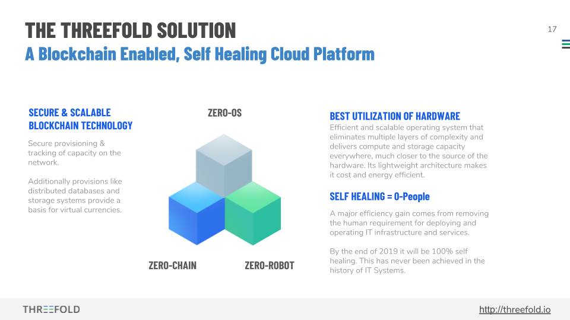

# Zero software

## ThreeFold Tech Technology Components Overview

- [Zero OS](#zero-os)
- [Zero Robot](#zero-robot)
- [Zero Chain](#zero-chain)

## Components Overview {#components-overview}

The TFTech intellectual property can be categorised into 3 areas:

1. [**Zero-OS**](#zeroos): A very secure and efficient Operating System
2. [**Zero-Robot**](#zeroRobot): 3Bot - virtual system administrators and operators on the grid keeping the grid healthy
3. [**Zero-Chain**](#zerochain): Blockchain technology

# Details of code stores

## Github Technology repositories (account)

The technology repository with all the source code can be found [here](https://github.com/threefoldtech/home).

[https://github.com/threefoldtech](https://github.com/threefoldtech)

## Zero OS

Zero-OS is a stateless and lightweight Linux operating system designed for clustered deployments to host virtual machines and containerized applications.  This operating system does not have User Interfaces (UI's) and only accepts instructions from the blockchain - executed by programs (robots).

This highly tuned operating system is

*   Zero-OS is stateless by not needing any locally stored data, not even Zero-OS system files
*   Zero-OS is lightweight by only containing the components required to securely run and manage containers and virtual machines

Key components of this efficient operating system:

*   [0-Core](https://github.com/threefoldtech/0-core): 0-core is the Zero-OS init process. It is used to bootstrap the user space and manage all processes subsequently. \
Interacting with 0-Core is done by sending commands through a Redis, allowing you to manage disks, set-up networks and create containers and start virtual machines.
    *   GitHub repository: [threefoldtech/0-core](https://github.com/threefoldtech/0-core)
    *   Documentation: [0-Core Documentation](https://github.com/threefoldtech/0-core/tree/development/docs)
    *   Getting started: [Getting Started with 0-Core](https://github.com/threefoldtech/0-core/tree/development/docs/gettingstarted)
*   [0-FS](https://github.com/threefoldtech/0-fs): Zero-OS File System is the file system used in containers and VM boot disk, which is actually a FUSE file system. Mounting the filesystem is done by using a flist, which is a relatively small SQLite database file, containing the metadata of the actual files and directories. On accessing a file Zero-OS fetches the required file chunks from a remote store, and caches it locally. This remote store is the Zero-OS Hub, discussed here below.
    *   GitHub repository: [threefoldtech/0-fs](https://github.com/threefoldtech/0-fs/tree/master/docs)
    *   Documentation: [Documentation](https://github.com/threefoldtech/0-fs/tree/master/docs)
    *   Getting started: [Getting Started with 0-fs](https://github.com/threefoldtech/0-fs/tree/master/docs/gettingstarted)
*   [0-Hub](https://github.com/threefoldtech/0-hub): The Zero-OS Hub is where all container images and and vdisk boot images are stored. The hub itself is a mix of 0-hub (frontend), with 0-flist (flist manipulation) and 0-db (database backend).
    *   GitHub repository: [threefoldtech/0-hub](https://github.com/threefoldtech/0-hub)
    *   Documentation: [Hub Documentation](https://github.com/threefoldtech/0-hub/tree/master/docs)
    *   Getting started: [Getting Started with the Zero-OS Hub](https://github.com/threefoldtech/0-hub/tree/master/docs/gettingstarted)
*   [0-Initramfs](https://github.com/threefoldtech/0-initramfs): the build toolchain needed to start from scratch to build a complete bootable Zero-OS system.
    *   GitHub repository: [threefoldtech/0-initramfs](http://github.com/threefoldtech/0-initramfs)
    *   Documentation: [Initramfs Homepage](https://github.com/threefoldtech/0-initramfs)

For the others see the repositories on ThreeFold Tech.

### Github repos

**LICENSE: All apache licenses, see license file in home of repo**

**Some exceptions see below.**

*   [https://github.com/threefoldtech/0-core](https://github.com/threefoldtech/0-core)
*   [https://github.com/threefoldtech/0-hub](https://github.com/threefoldtech/0-hub)
*   [https://github.com/threefoldtech/0-stor](https://github.com/threefoldtech/0-stor)
*   [https://github.com/threefoldtech/0-flist](https://github.com/threefoldtech/0-flist)
*   [https://github.com/threefoldtech/0-initramfs](https://github.com/threefoldtech/0-initramfs)
*   [https://github.com/threefoldtech/0-db](https://github.com/threefoldtech/0-db) (our database)
*   [https://github.com/threefoldtech/0-autobuilder](https://github.com/threefoldtech/0-autobuilder)
*   [https://github.com/threefoldtech/0-bundle](https://github.com/threefoldtech/0-bundle) (Apache)
*   [https://github.com/threefoldtech/0-fs](https://github.com/threefoldtech/0-fs)
*   [https://github.com/threefoldtech/minio](https://github.com/threefoldtech/minio) (Apache)
*   [https://github.com/threefoldtech/zos](https://github.com/threefoldtech/zos) (Apache)

Less important

*   [https://github.com/threefoldtech/seektime](https://github.com/threefoldtech/seektime) (tool)
*   [https://github.com/threefoldtech/ztid](https://github.com/threefoldtech/ztid) (tool)
*   [https://github.com/threefoldtech/openvswitch-plugin](https://github.com/threefoldtech/openvswitch-plugin)

## Zero Robot

The 3bot technology is being used is build using our Jumpscale technology. It functions as virtual system administrators that have specific knowledge on how to manage and operate different building block for the grid and specific customer facing IT workloads.  The 3bot technology is a core component of the digitalme code presented here:

### Repositories

**LICENSE: All apache licenses, see license file in home of repo**

*   Jumpscale Repo's
    *   [https://github.com/threefoldtech/jumpscale_core](https://github.com/threefoldtech/jumpscale_core)
    *   [https://github.com/threefoldtech/jumpscale_lib](https://github.com/threefoldtech/jumpscale_lib)
    *   [https://github.com/threefoldtech/jumpscale_prefab](https://github.com/threefoldtech/jumpscale_prefab)
    *   [https://github.com/threefoldtech/jumpscale_weblibs](https://github.com/threefoldtech/jumpscale_weblibs)
    *   [https://github.com/threefoldtech/digital_me_recipes](https://github.com/threefoldtech/digital_me_recipes)
    *   [https://github.com/threefoldtech/digital_me](https://github.com/threefoldtech/digital_me)
*   ZeroRobot
    *   [https://github.com/threefoldtech/0-robot](https://github.com/threefoldtech/0-robot)

## Zero Chain

Zero Chain is our blockchain technology.

*   [Rivine](https://github.com/threefoldtech/rivine) Blockchain technology for creating custom chains.
*   GitHub repository: [threefoldtech/rivine](https://github.com/threefoldtech/rivine)
*   Documentation: [Rivine Documentation](https://github.com/threefoldtech/rivine/tree/master/doc)

**LICENSE: MIT**

### Repositories

*   [https://github.com/threefoldtech/rivine](https://github.com/threefoldtech/rivine) (MIT License)
*   [https://github.com/threefoldtech/atomicswap](https://github.com/threefoldtech/atomicswap)** **(ISC License)
*   [https://github.com/threefoldtech/0-db](https://github.com/threefoldtech/0-db) (our DB): Apache
*   [https://github.com/threefoldtech/rivine-chain-explorer](https://github.com/threefoldtech/rivine-chain-explorer) (MIT License)
*   [https://github.com/threefoldtech/rivine-UI](https://github.com/threefoldtech/rivine-UI) (MIT License)

# Software used from elsewhere

All software we use is opensource and we have inspected the licenses.

Some examples:

*   Linux kernel and some components from Ubuntu, varia of opensource licenses
    *   E.g. [https://github.com/threefoldtech/qemu](https://github.com/threefoldtech/qemu)  (GPL) part of Linux
*   Sia nebulous = basis of our blockchain, MIT
*   Minio S3 server: Apache

We do not use any propriarity or closed software.
