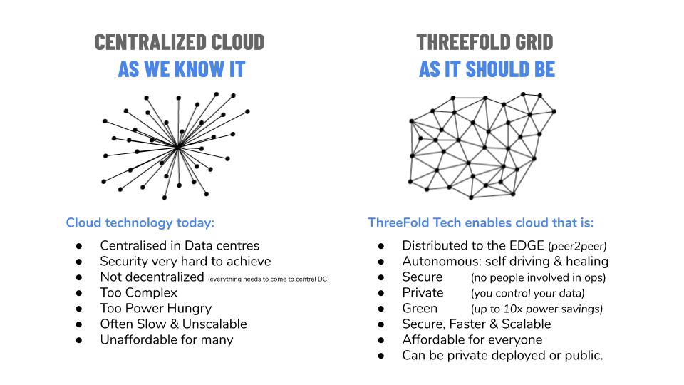

# Introduction

Today, IT capacity is mainly being delivered by means of centralized cloud technology which gets deployed in a private or public context. ThreeFold Tech has created technology to make the cloud 100% decentralized.

Our solution has two components: a 3Node, which is the box which can deliver capacity in a very compute/storage and power efficient manner, and the 3bot, which is our "digital self" – it is the decentralized component which makes autonomous IT possible and allows the grid to scale forever.

The 3bots are the coordinators which can run 100% autonomously – they are super intelligent digital creatures who know how to protect your data and how to deploy/manage any IT workload on the capacity layer, which is the grid of the 3Nodes.