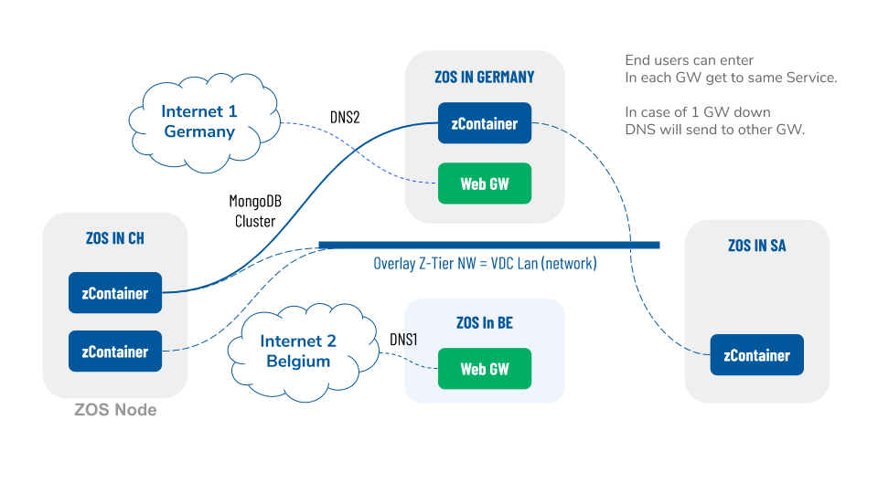

# 3 Node Primitive Workloads

The primitive workloads which are delivered by the Zero-OS:

## Compute = Containers-Based

The world started with hardware virtualization (virtual machines). It was a big step in the right direction but has lead to many layers of complexity, and total cost of ownership did not get lower. Security is also a big issue.

Containerization is the current wave for deploying compute applications. It is more flexible and has big efficiency benefits, but complexity and security remain a big issue. A high level of automation can be achieved but it is a very centralized model where centralized managed applications are the big boss.

In our Zero-OS, we have eliminated lots of layers and as such we can be much more efficient and we are not dependent on third-party software vendors. Our operating system is not managed by humans. It is an autonomous system which gives you the ability to run any container workload in all safety while achieving more performance and efficiency. Our container technology is compatible with docker, yet still has quite a lot of great benefits.

## Storage = Zero-DB 

<table>
  <tr>
    <td></td>
    <td>Backend Storage Engine

Can do +50.000 transactions per second
Can work on SSD & HD
Optimized for easy (soft/green) operation on HD
Always append store (can keep unlimited history)
Master-Slave replication

</td>
  </tr>
</table>

0-db is a super fast and efficient key-value store redis-protocol (mostly) compatible, which makes data persistent inside an always append datafile, with namespaces support.

## Network = Zero-GW and Zero-Net

<table>
  <tr>
    <td></td>
    <td>Z-GW = Network Gateway

Interfaces:

VXlan
IPv4/6
Bridge to Public Network
WireGuard
HTTP(S) proxy

Z-NET =  Overlay Network

Wireguard based encrypted overlay network between any containers

</td>
  </tr>
</table>

The Zero-nets are the overlay networks connecting all the containers. They can exit on multiple areas using the gateways. Here we called them web gateways but many types of access methods can be used (e.g. VPN technology or port forwarding). This allows for achieving full network and systems redundancy.

In the above picture, any datacenter or network gateway can fall away, and the solution will still be available.