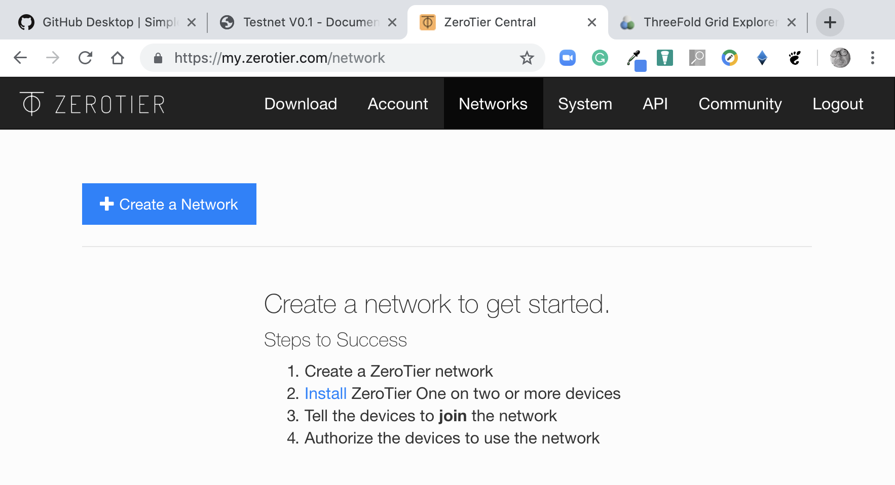

# Minimal (off TF grid) test setup

### Step 1: Get yourself a private overlay network

Zerotier is a technology that provides overlay networking capabilities. In the current version of the TF Grid, we use Zerotier networking technology to connect nodes on a grid and provide the necessary connectivity.  The next version of Zero-OS will use ipv6 natively to provide node connectivity.

### Step 2: Setup a private zerotier network.

Getting an overlaid network is essential - all connectivity requirements are currently delivered by zero tier technology 
- Go to: https://my.zerotier.com/login
- Create an account
- Log in to account
- Create a specific - test setup network: https://my.zerotier.com/network



Download the zero tier network client one or more controlling PC’s.  Choose the right version for the OS: https://www.zerotier.com/download/


Further instructions on how to create, install and get the private overlay network installed can be found on the zero tier web site.

Now we should be able to ping all devices connected to the zero tier networks regardless of where these devices are located.  It is an overlay network working behind NAT and FW’ed connections.

### Step 3: Get the Zero-OS bootloader

Take the zero tier network ID and go to http://bootstrap.grid.tf

Choose the master branch of the Zero-OS and input the zero tier network ID


Enable the development flag:  This disables a lot of the security features on the Zero-OS and allows you to connect to the Zero-OS without being authenticated.


Choose which bootloader method you want to use and download the correct image/script that belongs to that method 


Depending on the use case (virtual/physical) make a physical boot of the device using the selected method for the Virtualisation technology.
In this case - configure Virtualbox to boot the iso image 
After a while of will be booted completely (depending on your network speed)


And you can see the zero tier address of your private (zero tier) network, and the assumed private IP addresses. In your zero tier management portal there is a section with private overlay members.  Your booted Zero-OS should show up as a new member and you need to authorize it to become part of the secured overlay network.

At this point, you should have been able to get the following items done.  These need to be finished otherwise you will not be able to connect to your private, off-grid, unsecured Zero-OS machine.

1. Create a zero tier account and an overlay network
2. Download, install and configure the zero tier client for your laptop to connect with
3. Configure and Download the Zero-OS bootloader in the preferred format for your specific setup:  USB, ISO, PXE script.
4. Accept the booted Zero-OS node in your private overlay network.  This network should now have two nodes as a minimum:  Your laptop and your Zero-OS machine.

###  Step 4: Download and install the Zero-OS container manager

The Zero-OS container manager has been designed and created to hide a lot of complexity for simple testing of the effectiveness of the operating system and containers running on it.  It provides a simple interface for experimenting with a private setup.  The software is opensource and can be found here: https://github.com/threefoldtech/zos

The specific instructions to build the zos client on your operating systems are [here](https://github.com/threefoldtech/zos/blob/development/doc/building.md).  You have successsfully installed the zos client you should be able to run it (depending on where you have put the binary) as follows:


### Step 5: Launch and stop containers.

Here we assume that the IP address of the booted Zero-OS machine is `10.244.199.142`.  We add the machine to the zos configuration file:

```
zos configure --name="github-demo" --address=10.244.199.142
zos setdefault github-demo
```

After doing this the zos client is set to use the "GitHub-demo" machine as a default target and this can be tested by doing the following test-ping: `

```
zos ping
"PONG Version: master @Revision: b1a1a737352fce69fd71de5f8cf1ae175f4bdcab"
```

The zos container management app has a rich set of commands to launch, configure and stop containers.

```
Weynands-MacBook-Pro:testnetv0.1 weynandkuijpers$ zos
Usage:
  zos init --name=<zosmachine> [--disksize=<disksize>] [--memory=<memorysize>] [--redisport=<redisport>] [--reset]
  zos configure --name=<zosmachine> [--address=<address>] [--port=<port>] [--setdefault] [--vbox]
  zos remove --name=<zosmachine>
  zos forgetvm --name=<zosmachine>
  zos ping
  zos showconfig
  zos setdefault <zosmachine>
  zos showactiveconfig
  zos showactive
  zos cmd <zoscommand> [--jsonargs=<args>]
  zos exec <command>
  zos container new [--name=<name>] [--root=<rootflist>] [--hostname=<hostname>] [--ports=<ports>] [--env=<envvars>] [--sshkey=<sshkey>] [--privileged] [--ssh]
  zos container inspect
  zos container info [--json]
  zos container list [--json]
  zos container <id> inspect
  zos container <id> info
  zos container <id> delete
  zos container <id> zerotierinfo
  zos container <id> zerotierlist
  zos container zerotierinfo
  zos container zerotierlist
  zos container <id> zosexec <command>
  zos container zosexec <command>
  zos container <id> sshenable
  zos container <id> sshinfo
  zos container <id> shell
  zos container <id> exec <command>
  zos container <id> js9 <command>
  zos container js9 <command>
  zos container <id> mount <src> <dest>
  zos container mount <src> <dest>
  zos container sshenable
  zos container sshinfo
  zos container shell
  zos container exec <command>
  zos container <id> upload <file> <dest>
  zos container <id> download <file> <dest>
  zos container upload <file> <dest>
  zos container download <file> <dest>
  zos help <cmdname>
  zos --version
```

To list the running containers on the Zero-OS you enter the following command:

```
zos container list
+----+-----------+---------------+---------------------------------------------------------------+
| ID | Name      | Ports         | Root                                                          |
+----+-----------+---------------+---------------------------------------------------------------+
| 1  | zrobot    | zt*:6600:6600 | tf-official-apps/threefoldtech-0-robot-autostart-latest.flist |
+----+-----------+---------------+---------------------------------------------------------------+
```

To launch a new container you can get the required flist (file list, software can be found [here](https://github.com/threefoldtech/0-flist)) from the central hub on which these flists are collected and made avaiable to TESTNET users.  The principle of an flist is that the binaries needed to run the containerised applications are stored in a central hub (which can be many - the TESTNET one is one we installed bu you can create your own based on the software presented [here](https://github.com/threefoldtech/0-hub).


Let's take an example flist to showcase the simple structure of commands to launch a container: mongoDB


In order to launch the container we need to URL that point to the flist and parse it to the process manager on the Zero-OS.  The URL pointer to the flist is:
```
https://hub.grid.tf/weynand/mongo-latest.flist
```

Launching a container is done as follows:

```
Weynands-MacBook-Pro:~ weynandkuijpers$ zos container new --name="mongodb" --root=https://hub.grid.tf/weynand/mongo-latest.flist
INFO preparing container
INFO sending instructions to host
INFO container 3 is created.
INFO creating portforward from 1024 to 22
INFO waiting for private network connectivity
container private address: 10.244.199.142
Weynands-MacBook-Pro:~ weynandkuijpers$ zos container list
+----+---------+---------------+---------------------------------------------------------------+
| ID | Name    | Ports         | Root                                                          |
+----+---------+---------------+---------------------------------------------------------------+
| 1  | zrobot  | zt*:6600:6600 | tf-official-apps/threefoldtech-0-robot-autostart-latest.flist |
| 3  | mongodb | 1024:22       | weynand/mongo-latest.flist                                    |
+----+---------+---------------+---------------------------------------------------------------+
```

So we have a mongoDB running.  In order to inspect it the zos client has a built in feature to start an openssh daemon to provider remote access.  This will not be available in the production version of the Zero-OS but come in very handy for testnet.

```
Weynands-MacBook-Pro:~ weynandkuijpers$ zos container 3 sshenable
INFO adding SSH support to your container
INFO SSH support enabled
INFO waiting for private network connectivity


 * sshd is running

INFO waiting for private network connectivity
root@10.244.199.142 -p 1024
Weynands-MacBook-Pro:~ weynandkuijpers$ ssh root@10.244.199.142 -p 1024
^C
Weynands-MacBook-Pro:~ weynandkuijpers$ zos container 3 zerotierlist
[
  {
    "allowDefault": false,
    "allowGlobal": false,
    "allowManaged": true,
    "assignedAddresses": [
      "fc2e:9ff1:749b:f647:5a1c:0000:0000:0001/40",
      "10.244.60.251/16"
    ],
    "bridge": false,
    "broadcastEnabled": true,
    "dhcp": false,
    "id": "9bee8941b5717835",
    "mac": "36:e3:87:f2:1b:95",
    "mtu": 2800,
    "name": "tfgrid_public",
    "netconfRevision": 3,
    "nwid": "9bee8941b5717835",
    "portDeviceName": "zt3jn7qoma",
    "portError": 0,
    "routes": [
      {
        "flags": 0,
        "metric": 0,
        "target": "10.244.0.0/16",
        "via": null
      }
    ],
    "status": "OK",
    "type": "PUBLIC"
  }
]
```

From this `zerotierlist` command we can deduct which private IPv4 address is associated with the mongoDB container and have enabled the openssh deamon allowing us to access the container through ssh:
```
Weynands-MacBook-Pro:~ weynandkuijpers$ ssh root@10.244.60.251
Warning: Permanently added '10.244.60.251' (ECDSA) to the list of known hosts.
Welcome to Ubuntu 18.04 LTS (GNU/Linux 4.14.82-Zero-OS x86_64)

 * Documentation:  https://help.ubuntu.com
 * Management:     https://landscape.canonical.com
 * Support:        https://ubuntu.com/advantage

The programs included with the Ubuntu system are free software;
the exact distribution terms for each program are described in the
individual files in /usr/share/doc/*/copyright.

Ubuntu comes with ABSOLUTELY NO WARRANTY, to the extent permitted by
applicable law.

root@mongodb:~# ps
  PID TTY          TIME CMD
   83 pts/0    00:00:00 bash
   94 pts/0    00:00:00 ps
root@mongodb:~# ps -ef
UID        PID  PPID  C STIME TTY          TIME CMD
root         1     0  0 11:32 ?        00:00:00 /coreX -hostname mongodb -unprivileged
zerotie+     9     1  0 11:32 ?        00:00:01 mongod --bind_ip_all
root        60     1  0 11:34 ?        00:00:00 /usr/sbin/sshd
root        69    60  0 11:35 ?        00:00:00 sshd: root@pts/0
root        83    69  0 11:35 pts/0    00:00:00 -bash
root        95    83  0 11:35 pts/0    00:00:00 ps -ef
root@mongodb:~#
```


