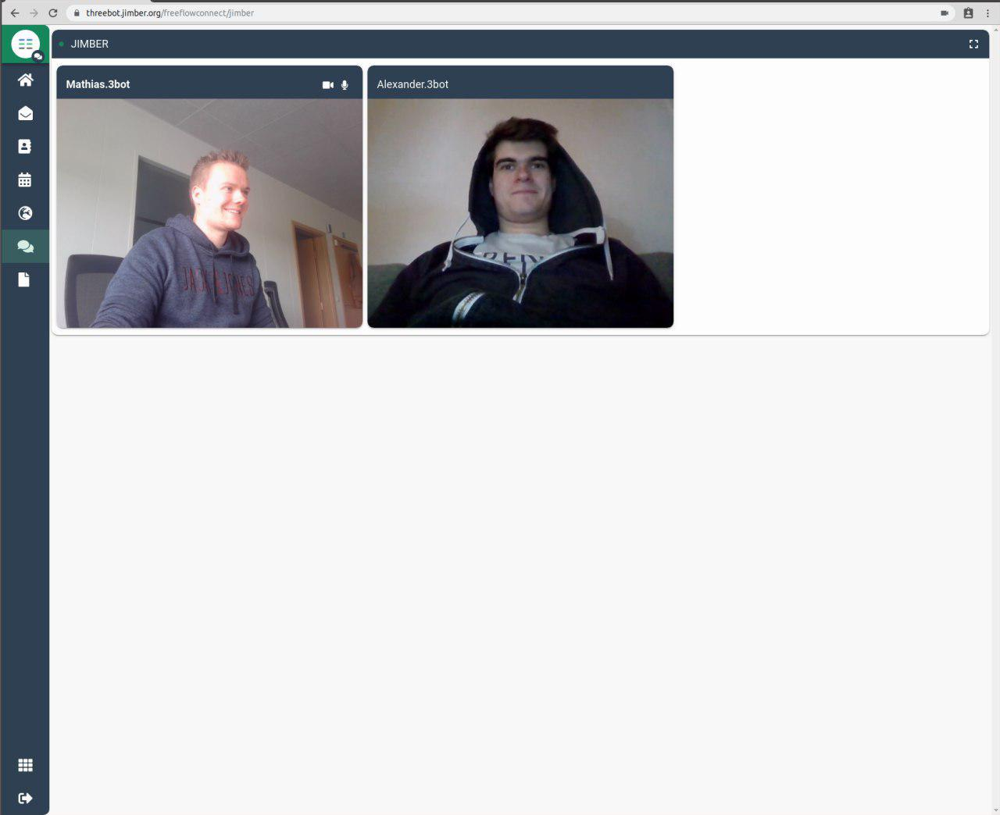

## 3Bot ADApps - Your digital avatar and gateway to the new internet!

We are working on the first version of the 3Bot ADApps - autonomous decentralized applications. The very first function will be a universal secure authentication on the ThreeFold Grid. Your 3Bot will be able to carry its own wiki system, database, blockchain, web server, indexing & search machine, e-commerce system, wallet, decentralized exchange, and more. 

### Mail:

Your 3Bot will have its own 3Bot-to-3Bot mail service. Totally decentralized and automated, it provides you with a secure and private email which maintains the convenience while eliminating the intermediaries. 

### Contacts: 

Your personal contact list, that integrates and synchronizes across all your Adapps. 

### Calendar:

Your standard private calendar, enabling you to plan your daily schedules. Integrate it with your other Adapps and make the most out of your time. 

### Wallet:

Your 3Bot wallet will be your private and safe access to your digital assets, whether it be TFT, Bitcoin or other digital currencies 

**Screenshot Coming Soon**

### Browser: 

Your private browser without limits. Explore unlimited information without third parties being able to trace your digital footprints. 

### FF Connect 

Peer to peer and group video conferencing directly from your browser. A totally private and decentralized way to connect with your designated circles. 

### Docs 

Where all your docs are stored. One place where all your documents, slides and sheets belong to you. Here you can create, edit, save your docs in a totally decentralized and private way. 

