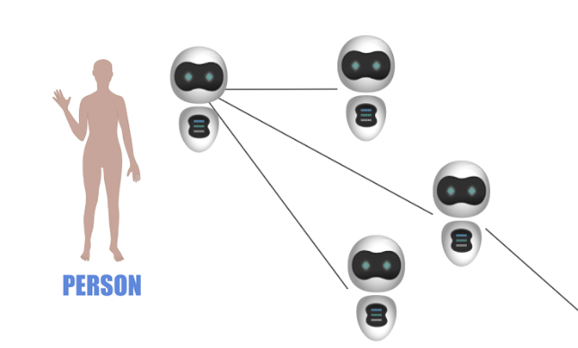

## **De****central****ized = different centralized.**

De-centralized has the world centralized inside but in a different way. The idea is not to make an organization or group of people the owner of a centralized system but rather the other way around, you or any legal identity becomes the center of your own digital life. More like how cells work in our body, all together we create a functioning world, by collaboration rather than suppression & control.

The idea, make our digital avatar (called a 3bot) the center of our own digital life. Each entity can define multiple circles. These circles define how we interact with other 3bots (rights, reach, searchability, …). Each human person or a legal entity owns one digital avatar also called the master 3bot. This is the main 3bot you interact with, this 3bot can own other 3bots. A legal entity can be a trust, a company or a government department. 

The 3bots are the actors inside such a system. Only 3bots own information and applications. All data is owned ONLY by 3bots who are OWNED by the before mentioned legal or person entities. All 3bots are registered in the ThreeFold 3Bot Blockchain (like a phonebook).

To let's such a system work each 3bot needs to have full control over the required IT resources.

