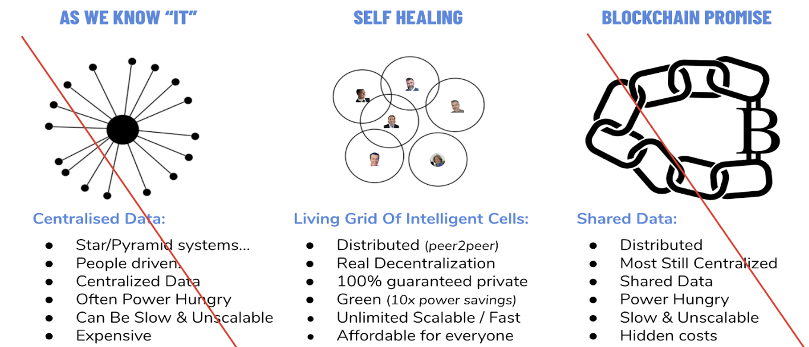

# **ThreeFold: a new paradigm of decentralization technology.**

Everything is a balance between efficiency and resilience. In our current society, the focus is too much on efficiency which has lead to too centralized systems. Centralized systems are too fragile (boom-bust cycles) and can lead to abuse as well (we became a product in centralized data management systems e.g. Facebook, ...).   

A new system is required which allows the world to function in a more decentralized way. Current Blockchain or Centralized server systems are the outer sides of this curve. 

A new system is needed with the right balance between centralization and distribution this is the true form of decentralization. We believe the right form is like a circle where we (or any legal entity) are the "center" of the de-**central**ized world. Blockchain technology is used inside your center of the circle (which we call a 3bot) as well as finding consensus in between the circles (3bots). The combination of both concepts makes a sustainable, viable solution possible.

This solution would sit in the sustainable part of Bernard Litaer efficiency vs resilience graph.

