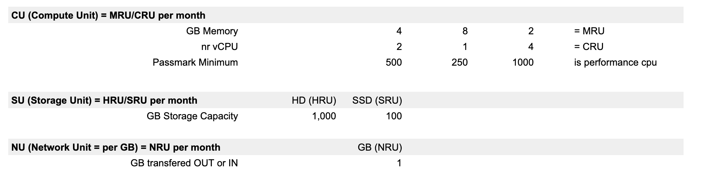

## Cloud Units

Cloud units are the way to account for farmed and used capacity. Cloud units are the compute, storage and network equivalent to kWh - kilowatt-hour - the unit of energy.

We use three categories of units:

- Compute: the amount of data processing power, specified as the number of virtual CPU cores (logical [CPUs](https://en.wikipedia.org/wiki/Central_processing_unit)) and RAM ([Random Access Memory](https://en.wikipedia.org/wiki/Random-access_memory))
- Storage: the size of data storage capacity
- Network: the amount of data that travels in and out of the acquired storage units or data that travels to/from compute capacity expressed in GB.

Its a very easy way how to express capacity.

- The farmers define the price per CU,SU,NU
- When a solution gets requested, it always gets converted to required amount of CU,NU,SU

### link to resource units

!!!include:resource_units_table
!!!include:resource_units_calc_cloud_units
