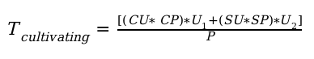

## Farming rules

### Farmer activities

A farmer is an investor in hardware which he commits to the TF Grid.  The TF Grid is a public, shared, neutral and private grid of capacity on which capacity consumers can build anything IT.  The farmer receives a digital return for his investment called the ThreeFold Token (TFT).  There are two types of events that make a farmer earn tokens:

* **Farming Tokens:** as a result of connecting server hardware to the ThreeFold Grid
* **Cultivation Tokens:** as a result of their Farming Pool capacity being utilized by ThreeFold Grid Capacity users
The farmer is expected to keep his hardware up and running at all times which requires him to have the hardware housed in a safe and suitable location for computer equipment.  It does not have to be a datacenter environment, as long as the location is wind, dust and water proof and has stable temperature and humidity levels should suffice.

### Farmer types

The TF Grid does not specify any shape, form or legal status for farmers. The TF Grid welcomes anyone that wants to contribute to build this global decentralized grid.  In the two years of it's existence the TF Grid has seen the following types of farming business develop:

* **Independent certified Farmers** use ThreeFold certified hardware (HPE) and own the full responsibility for installing, finding a location and providing power and connectivity
* **"Do It Youself" (DIY) Farmers** use their own choice of hardware (non-certified hardware) and own the same full responsibility to install, house and keep power and network connectivity up and running.
* **Cooperative Farmers** form a cooperative or company where multiple investors pool their finance and purchase certified (or uncertified) hardware and take full ownership of installation and location, power, and connectivity.  These cooperations can have dedicated people looking after a number of installations of the cooperative

### Farming capacity types

In total there are three types of capacity that can be created by farmers.  These capacity types are:
* **Certified Capacity:** The hardware is locked in such a way that nobody (including the owner, farmer) can access and configure low-level BIOS and other features. It is a black box to the farmer and anyone else that has physical access to the machine. The only control a farmer has over certified capacity is turning it on or off. It will, therefore, achieve a very high level of security for capacity consumers (developers, system integrators and endusers).  This forces the hardware to boot s single specific version of zero-OS providing the guarantee that the OS has not been tampered with. This allows the farmer to yield a higher certified sales revenue (available in Q1 2020).  The current strategic partner that we are working with who is producing certified hardware is **HP Enterprise**.
* **Do It Yourself (DIY) Capacity:** The hardware comes from unknown sources, can be new or existing, and therefore does not have any restrictions in place for low-level access to BIOS and other configuration applications. This results in a less secure environment and more likely lower capacity revenue for the farmer.
* **Managed Capacity:** Managed capacity is produced by farmers that have a virtual machine install base.  Many of the cloud providers and (large) enterprises have a server install base that allows for peak workloads and/or test and development workloads.  As this capacity is not 100% utilized all the time we offer to run zero-OS on top of a hypervisor capitalizing the capacity available and not doing much.  There is no guarantee with regards to performance as the managed farmers control the actual hardware and hypervisor.

For specific information on the capacity types please select "Capacity types" in the menu on the left.

### Farming Token generation rules until public Grid Capacity Utilization (Q1 2020):

There will be no distinction between certified and uncertified capacity up to the point of the commercial grid launch.  This is currently planned for mid Q1 2020. All the capacity that is build up in the period up to commercial launch will be treated the same.  Certified and non certified hardware will mint the same amount of tokens as both hardware types are used for the same purpose: TESTNET.

From the launch onwards any new capacity presented to the TF Grid will be treated as displayed in table available under "Capacity type" in the menu on the left.  The difference is the difficulty factor in token minting (16 for uncertified and 8 for certified) for the farming effort and when capacity consumption starts certified capacity incurs a 10% support license fee for TF Tech, the technology creating company.  Both type of capacity will pay a 10% token fee to the ThreeFold Foundation.

### Farming TFT minting

Farmers mint tokens by dedicating hardware to the TF Grid.  Tokens are minted based on the amount of capacity that is presented to the grid.  The formula use to calculate the amount of minted tokens is as follows:

In which the variables are:

| Variable | Description |
| -------- | ----------- |
| T | Number of tokens received monthly|
| CU | Number of Compute Units deployed |
| SU | Number of Storage Units deployed |
| ACPT | Average Market Compute Unit price (in $) divided by Token price (in $) at time of connection |
| ASPT | Average Market Storage Unit price (in $) divided by Token price (in $) at time of connection |
| D | Difficulty level (certified=8, uncertified=16) |

The difficulty level represents how much TFTs are undervalued at the time of capacity creation. For certified capacity it works out that when 100% of capacity sold at connection time, then 8 times more TFTs would be required than have been issued. This mechanism allows the token to grow in value while remaining backed by the revenue potential of the TF Grid.

To calculate the number of tokens farmed we use compute, and storage market pricing numbers. For so-called compute and storage units we take the average price in the market taking into account the highest and lowest price available.  These numbers will be periodically updated, at least once every year.

The current price levels are set to:

| Description | Price [USD] |
| -------- | ----------- |
| Price for a compute unit (2 logical cores, 4GB of memory) | 15.00 |
| Price for a storage unit (1TB of archiving space) | 10.00 |

The token price currently sits at USD 0.12 with limited liquidity. Once liquidity is over a certain amount of traded tokens per day we will take the average actual token price as the token price for calculating the number of farmed tokens.  With these numbers ACPT and ASPT become:

| Variable | Value [] |
| -------- | ----------- |
| ACPT | $15.00 / $0.12 = 125 |
| ASPT | $10.00 / $0.12 = 83.3 |

For compute and storage unit definition please see the "Compute Units" and "Storage Units" items in the left column.

### Cultivation Token calculation

The ThreeFol tokens are the only available payment mechanism for capacity consumers reserving capacity. They are regular TFT's created by farmers and use by grid consumers to pay for capacity.  This is the TF NETWORK tokonomu.

Consumers find the capacity they nee in a peer to peer search mechanism that makes demand and supply meet. The farmer will set and announce his capacity pricing in USD.  The does this by using the units which describe the capabilities of this hardware.  There are 2 units:

| Variable | Description |
| -------- | ----------- |
| CP | Farmer’s Compute Unit price in USD |
| SP | Farmer’s Storage Unit price in USD |

The farmer also needs to set the (or accept a TF Grid default ) exchange rate for TFT's to US dollars.  The TF Grid will present a default average token price in US dollar which is the result of the active digital exchanges that trade the TFT token.  At this point in time the TFT is not trade much and there is minimal liquidity of the TFT and therefore the same value is taken as for minting purposes: 0.12 USD.

So a farmer can accept the default setting for the exchange rate, or set his own exchange rate.  The actual payment for capacity rental will be done in TFT's.  To calculate the

 | Variable | Description |
 | -------- | ----------- |
 | CU | Total Compute Units [#] |
 | SU | Total Storage Units [#] |
 | CP | Compute Unit price [USD] |
 | SP | Storage Unit price [USD] |
 | U1 | Utilisation of Compute Units [#]|
 | U2 | Utilisation of Storage Units [#]|
 | P | Token value [USD] (Grid default or Farmer set) |

For more details around the CU and SU definition please click the respective items in the menu on the left.

### Fees on Cultivation TFTs

There are two types of fees:
* 10% to ThreeFold Foundation for promoting the capacity on the grid
* 10% to TFTech License that keeps the TF Grid software components up to date and provides farmers support

|    Capacity Type   | TF Foundation   | TFTech|
| ------------------ | ---------------| ------------------ |
| Certified | 10% | 10% |
| DIY | 0% | 10% |

#### SLA requirements
For certified and DIY capacity there are Service Level Agreement (SLA) requirements.  These requirements are there to make sure that the presented capacity is usable and presents sufficient reliability for grid consumers to trust their compute and storage workloads to operate.  To receive the farming token described above the farmer needs to meet a minimal level of availability.

This table represents the initial numbers applicable to Threefold capacity farmers and ThreeFold Grid farmers.  These numbers may change going forward.

For capacity farming, we need to have a minimum uptime of the compute and storage capacity  to achieve.  This table represents the initial numbers applicable at launch time:

|  Capacity Farmer | Type | Europe | Africa | North America | Australia | Asia | South America |
| ---------------- | ---- | ------ | ------ | ------------- | --------- | ---- | ------------- |
| UPTIME SLA | DIY | 98% | 90% | 99% | 99% | 99% | 90% |
|     | Certified | 99.5% | 95% | 99.5% | 99.5% | 99.5% | 95% |

The network needs to comply with minimal uptime guarantees. This table represents the initial number applicable at launch time:

|  Capacity Farmer | Type | Europe | Africa | North America | Australia | Asia | South America |
| ---------------- | ---- | ------ | ------ | ------------- | --------- | ---- | ------------- |
| NETWORK SPEED SLA | DIY | NA | NA | NA | NA | NA | NA |
|                             |Certified | 5Mbps/TB | 1Mbps/TB | 5Mbps/TB | 5Mbps/TB | 5Mbps/TB | 1Mbps/TB |

### Farming TFT release requirements

Farming pool uptime as defined at the time of registration on the TF Grid has to be met per period to get the farming tokens as defined under **Farming TFT calculation** section (see above)

Farming tokens are paid after the end of each period which represents a month that has the same number of days during the 60 months aka 5-year farming duration. This generic period is 30.44167 days which is 730.6 hours.

For the first period of farming the days online will be paid. Example: farming starts on the 8th day of period 1 of 60 periods (22.44167 = 30.44167 - 8) and is paid out in farming tokens. For the 60th period, 8 days are paid to complete the to ken payment for 60 periods which represents 5 years.
