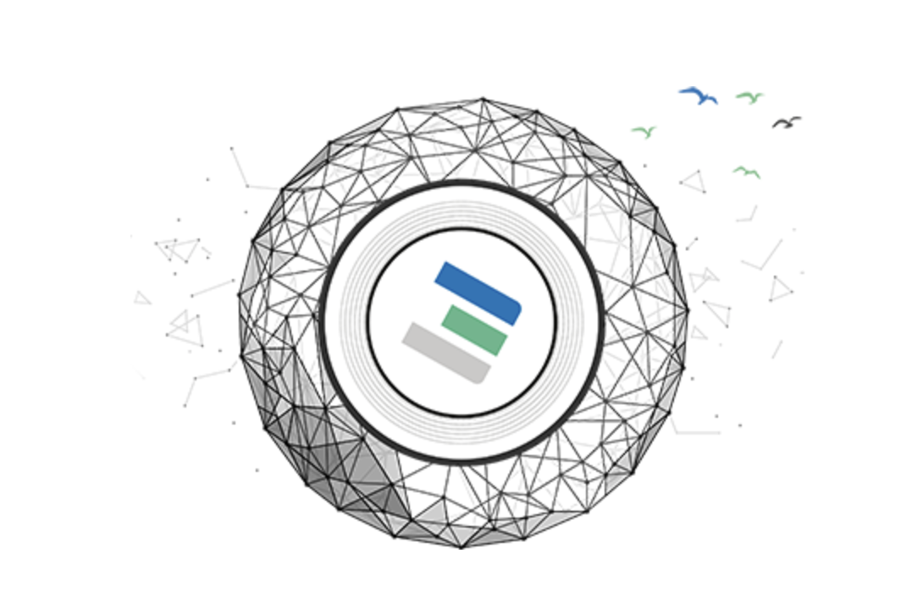

# Become A Farmer

To become a farmer a few decisions need to be made:

- do you want to host the hardware yourself?
- do you want your hardware to be hosted?
- do you not even want to own hardware but still farm ThreeFold Tokens?
- do you want to become a certified or a DIY farmer?

Once you have made up your mind you have the following choices:

Contact one of the two existing ThreeFold Cooperatives - [Mazraa](https://www.mazraa.io) in Dubai or [Bettertoken](https://bettertoken.com/bettertoken-shop.html) in Belgium.

They can offer you the following:

- Purchase of certified hardware which has all the software and credentials pre-installed so when you order a box its plug and play.
- Hosting the certified hardware you purchase from them in their facilities. (coming soon)
- Subscribe as a cloud farmer and earn ThreeFold Token. (coming soon)

If you like to setup your farm yourself without the help from a ThreeFold cooperative you ether 

- Purchase standard INTEL or AMD based server hardware - new or if used not older than 4 years

- Purchase certified hardware in a configuration which is optimized for token earning and security. Which configurations are certified and where you can buy them can be found [here](hpe.md)

Only the purchase of certified hardware will give you the option to become a certified farmer.

Both of the 'set up your own farm' options mean that you need some technical expertise to create your own farm and add your node(s) to the ThreeFold Grid. Details can be found [here](https://sdk3.threefold.io/#/farm_setup_management)
