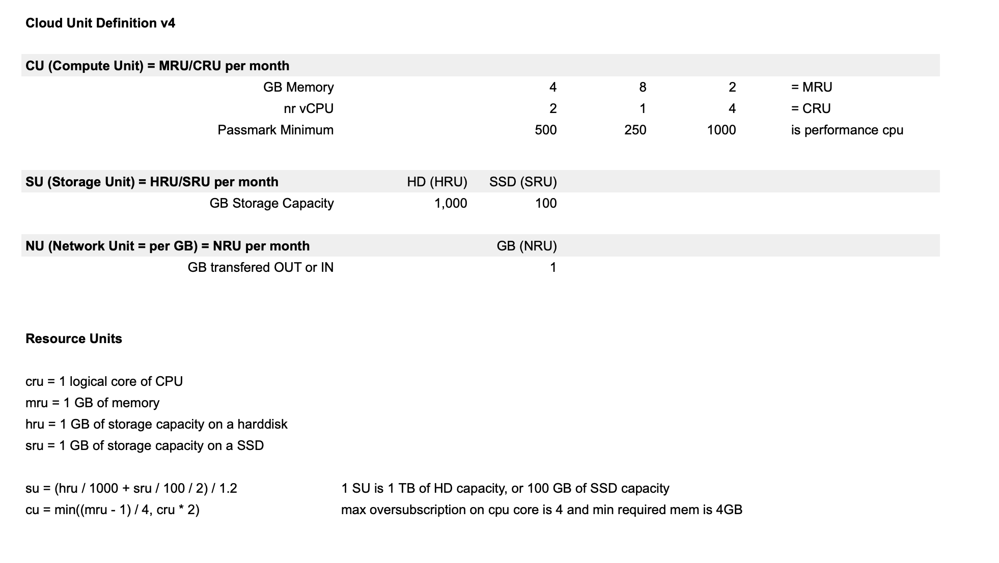

# Cloud Units

In this table you find all you need to know to how we calculate cloud units on the ThreeFold Grid.

### Some Examples of CU and SU in Detail

#### Compute Unit (CU): 

4 GB memory & 2 virtual CPU 

Recommended price on TF Grid = 8 USD

Market price = between 40 USD and 180 USD

#### Storage Unit (SU):

1TB of netto usable storage (1000 HRU)

Recommended price on TF Grid = 5 USD

Market price = between 20 USD and 200 USD

**Note:** If you want tolearn more about the usual pricing of cloud resources check here: https://www.cloudorado.com/
