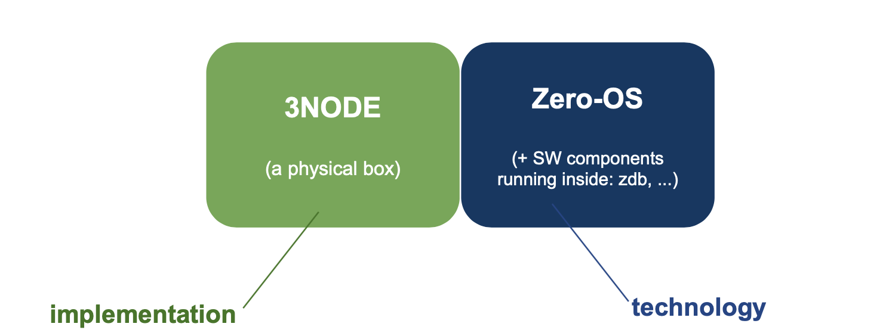
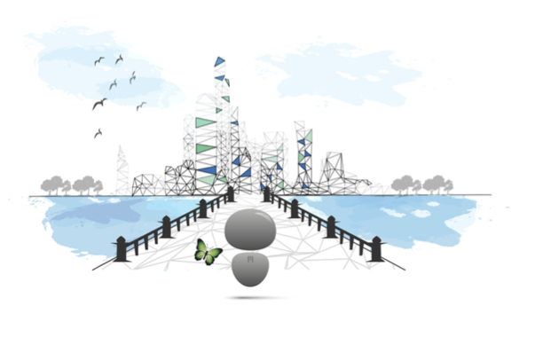
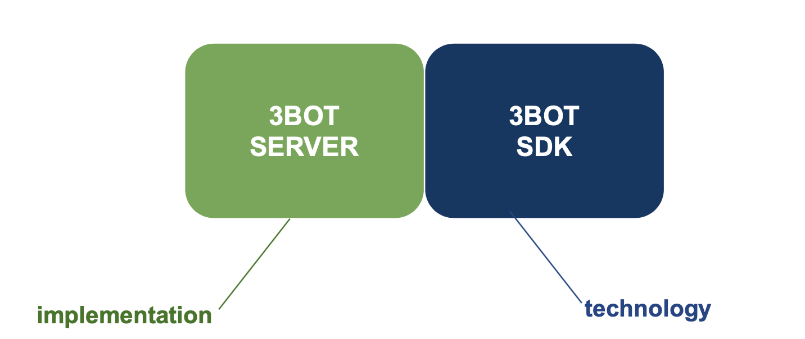

# The ThreeFold Grid
The ThreeFold Grid was built from a complete review of the current Internet architecture. It simplifies the architecture though it's autonomous (self-healing) technology, the first of it's kind, and provides a total new approach to the global Internet. It is the largest peer-to-peer grid of Internet (compute, storage and network) capacity in the world. platform on which experiences (or service) can be built on.

Many projects live on top of the ThreeFold Grid - such as the ThreeFold Peer2Peer cloud and 3Bot.

## The Capacity Layer

An Internet consists itself of storage, compute and network capacity. Think of the capacity layer as being the foundation of the Internet. It is where hardware and software components work together to provide use experience. The ThreeFold Grid's capacity is distributed across 21+ countries, cumulating 500+ nodes and 40 PB of capcity, it is the largest peer-to-peer grid in the world.

Any application which can run on Linux, can run on the ThreeFold Grid but with more speed, cost-efficiency, privacy & security, sustainability, and more. Any individual or organization can utilize the ThreeFold Grid's capacity for any current or future IT workload - such as Blockchain, IoT, 5G, AI and VR/AR, and benefit from improved performance.

The ThreeFold Grid represents the most advanced and only true peer-to-peer network of capacity in the world.

ThreeFold's Zero OS operating system is used to run on server or storage hardware which we call then 3Nodes. 

## The Autonomous Layer

Imagine the autonomous layer as being the bridge between users and the capacity layer. The system is self-driving and self-healing, therefore removing the human requirement for deploying and operating IT infrastructure and services, and vastly minimizing the possibility of hacking. The autnomous technology is what powers the peer-to-peer possibilities on the ThreeFold Grid.

The idea behind the autonomous layer is to make every individual digitally independent and enable a digital world inspired by nature. Just like no one would be able to access your face-to-face conversations or be aware of what you do in your everyday life as you only would know it, the autonomous later undertakes all the processes in the background for you to remain at the center of your digital life and autonomous. 

ThreeFold's 3Bot SDK (Software Development Kit) technology powers the 3Bot Server. The 3Bot Server is th emain component of the Autonomous Layer.