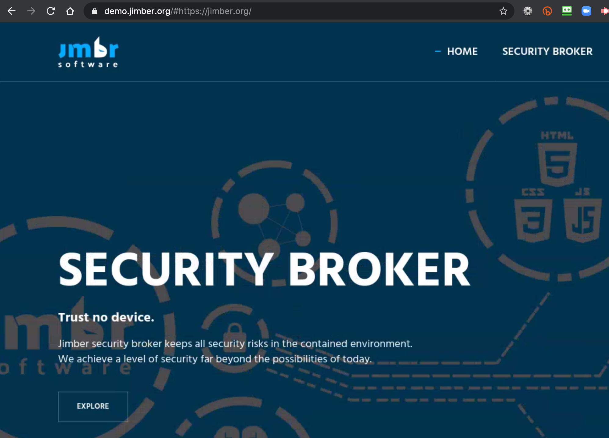

# Project: 3Bot Browser

3Bot browser is a browser that runs close to your digital twin - 3Bot. It presents you with the ability to have a browser on the ThreeFold Grid running anywhere you want and to securely stream the content back to your local browser.  

### Purpose

A lot of hacking happens in your current browser, but this won't be possible with 3Bot browser. Millions of people are looking for a neutral browser solution which is:
- neutral 
- allows you to own all your data
- faster, simple to use
- cost-effective
- able to work everywhere
- has advanced features like real time collaboration

### Status

- We have a full blown first version active and ready to be launched.
- We are now fundraising to make the next generations.

### 3Bot Browser experience will be on 3bot

See [3bot main page](3botproj).

### Team

[The Jimber Team](https://www.jimber.org/contact.html)

### Funding

- Required funding to finish road map as described below: 3,000,000 TFT
- ThreeFold and Jimber work together in close collaboration, the 3bot browser is IP from Jimber but ThreeFold can use this for the grid use-cases with no limits, thats also why we further want to sponsor this project.

### Road map

| Name         | Date   | Description | Remark |
|:-------------|--------|-------------|-----------------|
| tbd |  2020/05 | all basic functionality in. | DONE |
| tbd |  2020/08 | new rendering engine based on opengl in browser | huge effort but large parts done already |

### Demo

- If you want to see more about 3Bot, we invite you to check the https://demo.jimber.org/
- Experience [a slide deck which runs in the 3bot browser](https://demo.jimber.org/#https://docs.google.com/presentation/d/e/2PACX-1vTl6h1bwIiurjbvUlK5Agce0cijBuEu7meCPNDHLArfr5wAHbaOC0X6fUoyVJAncAzD4PLMsA55E9xc/pub?start=false&loop=false&delayms=3000&slide=id.g71c168e374_0_7573)
- If you need any more information you can contact us over chat on the Threefold website.

### Architecture

