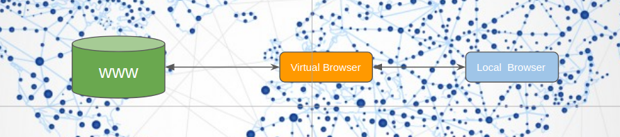

## Project: 3Bot Browser

### Purpose
3Bot browser is a browser that runs close to you digital avatar online. It presents you with the ability to have a browser on the TF Grid running anywhere you want and to securely stream the content back to you local browser.  

It provides you with privacy and independence, so people and companies cannot track your whereabouts based on the location of your browser.

### Goal
Create an independent and private browsing experience on the internet.

### Funding
See roadmap below

### Team

[The Jimber Team](https://www.jimber.org/securityBroker.html)

### Roadmap

Roadmap and investment plan for the Artheon Virtual VR museum

| Name         | Date   | Description | Recommendations | Funding |
|:-------------|--------|-------------|-----------------|---------:|
| V1.0 |  2020/05 | Ability to launch your 3bot browser in a location of your choice and browse with privacy and safety. |  |2,000,000 TFT |