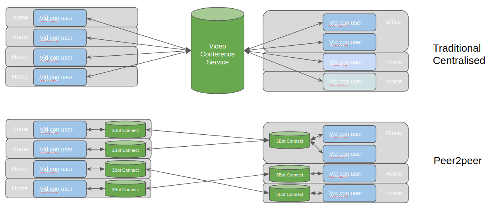

## Project: 3Bot Connect

### Purpose
Provide private and indepedent and peer-to-peer video conferencing. Other conference solutions use centralised infrastructure and software to connect people.  The central infrastructure needs enormous connectivity and hardware to connect large numbers of people.  The 3bot connect solution creates peer-2-peer connections 

### Goal
Create an independent and private 2FA authentication mechanism

### Funding
See Roadmap

### Team

[The Jimber Team](https://www.jimber.org/securityBroker.html)

### Roadmap

Roadmap and investment plan for the 3Bot connect app.

| Name         | Date   | Description | Recommendations | Funding |
|:-------------|--------|-------------|-----------------|---------:|
| V1.0 |  2020/05 | Ability to have a 3bot based 2FA mechanism that allows you to independently and private authenticate without being tracked by internet giants.. |  |2,000'000 TFT |