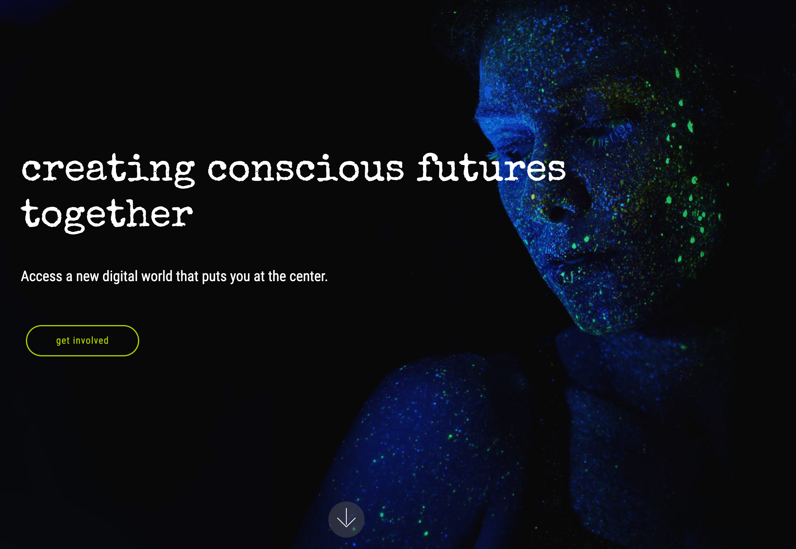

## Project: 3Bot

3bot's vision is to shape a conscious digital world together. A fair world where all individuals, across regions, have equal chances to learn, partake, and succeed. A world where freedom and liberalism are at the center. A world where we live sustainably and where we think circularly. The priority is to ensure the best environment possible for us and all living species of this plant. Creating circular economies that use resources consciously, and where that which has true value becomes the center. Future economies will be digital and promote sustainability.

A first website has been created at [https://3bot.org/](https://3bot.org/), an updated version is being created as we speak, the new website will launch 20 May.

Learn more about this project on [conscious internet 3bot](https://www.consciousinternet.org/index.html#/projects/3bot).

### Goal

- Deliver a app which replaces our full digital life as we know it today.
- We already have lots of applications (experiences done) but a lot more needs to happen.
- Already today we have office, filemanager, mail, chat, contacts, ... ready in a working proof of concept, feel free to ask for a demo.

### Impact

Today's economies are successful when depleting our planet's resources. This is a flawed approach to value creation. 3Bot is one step closer towards saving our planet which will connect you to new sustainable digital economies that help drive success through green initiatives and value exchanges that live through 3bot experiences, minimizing carbon footprint, using resources consciously and creating a world where we live sustainably and through digital economies that promotes sustainability.

### Powered by ThreeFold

3bot is built by Threefold Tech and lives on Threefold grid, serving as the gateway of the new digital world, the new internet and peer-to-peer experiences. By using 3bot SDK, 3bot users could create their own experiences, functionalities and features within the Threefold Grid’s peer-to-peer ecosystem.

### Join saving our planet!

While 3bot may seem like a technological solution, its roots and goals are strongly humanitarian. Every person who signs up for 3bot makes a significant impact. The P2P infrastructure is up to 10x more efficient and sustainable and ensures that data privacy and security is preserved. The internet cost is less than half a dollar a month per user, greatly increasing access to underserved communities. Additionally, the 3bot ecosystem is creating a number of P2P experiences and solutions such as videoconferencing, file storage and social networking that will impact both the effectiveness and security of online communication.

### Team

There are multiple teams identified to work on the 3bot, one is [The Jimber Team](https://www.jimber.org/contact.html).

### First generation website

