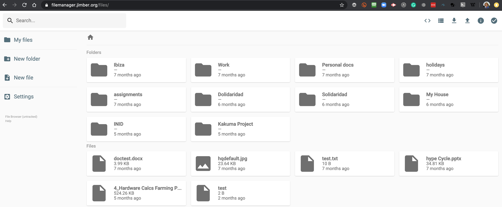

# Project: 3Bot Files

### Purpose

3bot Files provides functionality to store (personal) files in a secure and private way. The 3Bot Files solution uses you personal digital twin (see 3Bot project) to store and retrieve files from storage capacity rented on the TF Grid. Files are stored securely in a very efficient way, using a lot less storage space to do so and also in a much more sustainable manner.

The vision is to create an independent and private file storage facility to safely store, retrieve, and share you personal digital files. Millions of people are looking for a neutral file management solution which is: 
- neutral and allows you to own all your data
- faster
- simple and easy to use
- more cost effective
- works everywhere 
- equipped of advanced features like video/audio streaming
- able to seamlessly integrate with other website and documents.

### Status today

- We have a full blown first version active and ready to be launched.
- We are now fundraising to make the next generations.
- The 3bot files is a huge project and has many technical challenges but we already got very far. 

### Demo

- If you want to see more about 3Bot, we invite you to check the [3botdemo](3botdemo.md)
- If you need any more information you can contact us over chat on the Threefold website.

### 3Bot Files experience will be on 3bot
See [3bot main page](3botproj).

### Team

- [The Jimber Team](https://www.jimber.org/securityBroker.html) + various opensource developers.
- lead developer: Hamdy

### Funding

- Required funding to finish roadmap as described below: 3,000,000 TFT

### Roadmap

| Name         | Date   | Description | Remark |
|:-------------|--------|-------------|-----------------|
| V0.9.0 |  2020/05 | all basic functionality in. | DONE |
| V0.9.1 |  2020/06 | sync | ALMOST DONE |
| V0.9.2 |  2020/06 | granular security | ALMOST DONE |
| V1.0 |  2020/07 | fuse layer, mount as filesystem |  |
| V1.1 |  2020/08 | streaming interface (video/audio) |  |
| V1.2 |  2020/Q8 | integration with 3bot office |  |
| V1.3 |  tbd | integration with the TF ZeroStor |  |

