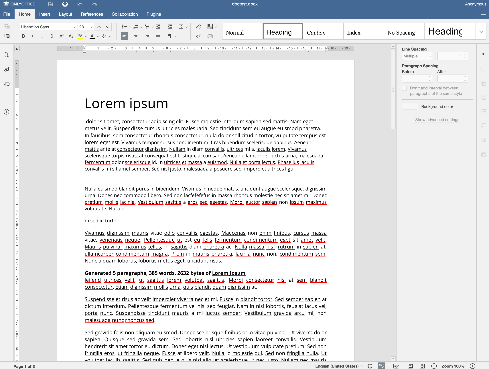
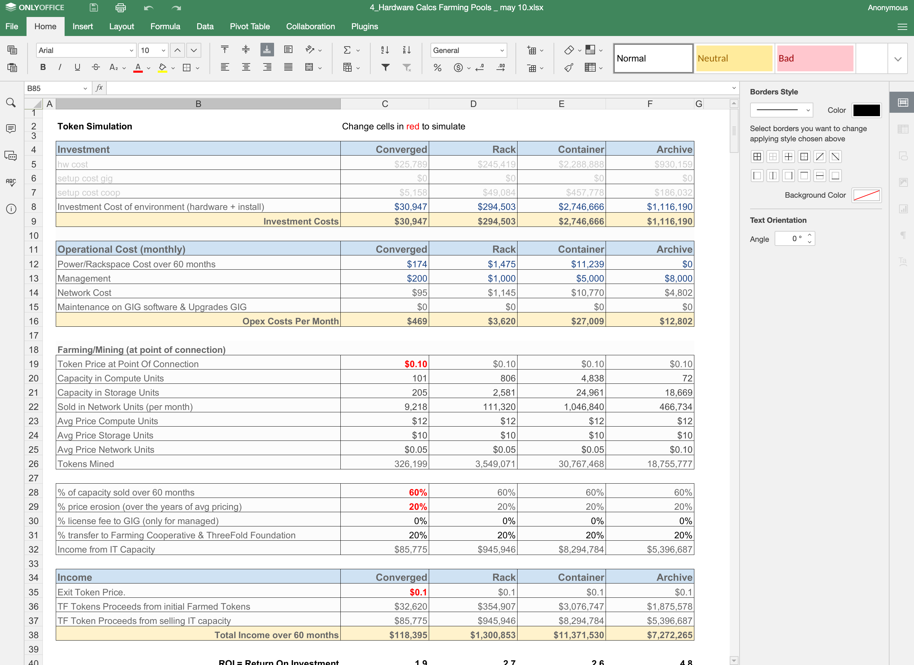
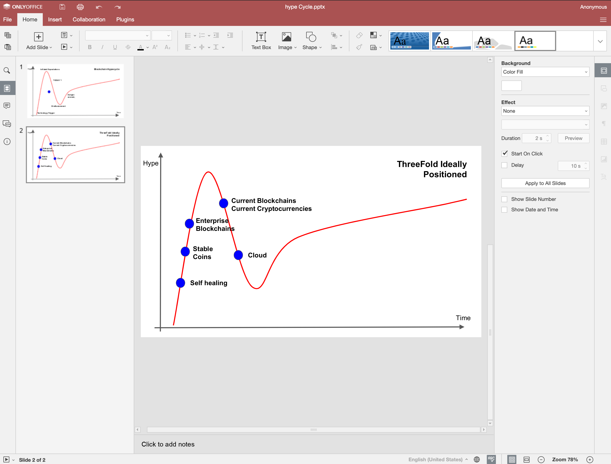

# Project: 3Bot Office

To enable 3Bot Office, we integrated with [onlyoffice](https://www.onlyoffice.com/) for this, which is in our opinion the best made office solution that gets close the above cited criteria. Only Office is open-source (which we use today) but we also want to make a license deal with them to cater for support and allow even enterprises to use this on a larger scale. 

### Purpose

The purpose of 3Bot Office is to deliver an online office environment that is 100% integrated with your 3bot only 100% private to you. Millions of people are looking for a neutral office solution which is:
- neutral 
- allows you to own all your data
- faster, simple to use
- cost-effective
- able to work everywhere
- has advanced features like real time collaboration

### Status

- We have a full blown first version active and ready to be launched.
- We are now fundraising to make the next generations.

### 3Bot Office experience will be on 3bot

See [3bot main page](3botproj).

### Team

- [The Jimber Team](https://www.jimber.org/securityBroker.html) and various open-source developers.
- Lead developer: Hamdy

### Funding

- Required funding to finish road map as described below: 5,000,000 TFT

### Road map

| Name         | Date   | Description | Remark |
|:-------------|--------|-------------|-----------------|
| V0.9.0 |  2020/06 | all basic functionality in alpha version. | ALMOST DONE |
| V0.9.1 |  2020/07 | granular security | ALMOST DONE |
| V0.9.1 |  2020/07 | 3bot circles integration  | | 
| V0.9.1 |  2020/07 | integrated in 3bot browser | |
| V0.9.1 |  2020/07 | integrated with 3bot files | |
| V1 |  2020/Q4 | production ready release which can be used by millions of people| |

### Demo

- If you want to see more about 3Bot, we invite you to check the [3bot demo](3botdemo.md)
- If you need any more information you can contact us over chat on the Threefold website.

### screenshots

