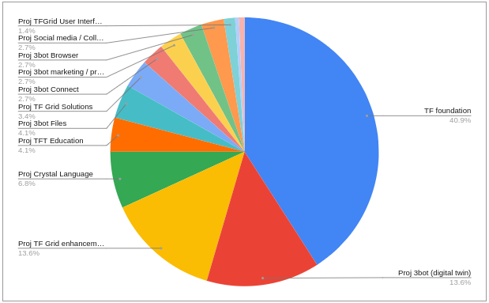

## Project: Foundation

### Purpose

### Goal

### Funding

Launching TFT onto Stellar May 15	

| Project Name | Sponsor TFT's | Description |
|:-------------|---------------:|:------------|
| TF foundation	| 30,000,000	| 	TFT Liquid on Stellar: foundation funding |
| TFGrid User Interface	1,000,000	|	easy to use interface to provision IT workloads on the grid |
| 3bot Connect | 	2,000,000	|	alternative to zoom |
| 3bot Browser |	2,000,000	|	personal browser running close to our 3bot |
| 3bot Files	| 3,000,000		| our personal cloud on TFGrid, alternative to dropbox |
| TF Grid enhancements |	10,000,000	|	further improvements on grid as sponsored by the TF foundation |
| 3bot (digital twin) |	10,000,000	 |	80% of our digital life implemented on top of the 3bot |
| 3bot marketing / prod mgmt |	2,500,000	 |	bring the 3bot alive as a digital twin |
| TF Grid Solutions |	2,500,000	|	opensource solutions ported to the grid |
| TFT Education |	2,500,000	|	world first real peer2peer education system on top of TFGrid |
| TFT TimeBank	 | 333,333	 |	world first global time token, on top of TF Grid, +200k users today |
| TFT Virtual Reality Museum |	500,000	 |	virtual reality museum online of 500.000 artworks as part of TF Grid |
| Social media / Collaboration |	2,000,000	|	combination of facebook, linkedin, slack |
| Crystal Language	| 5,000,000	 |	core language used to implement the 3bot and future SDK for TF |

In percentages:

### Team

### Roadmap

### Other