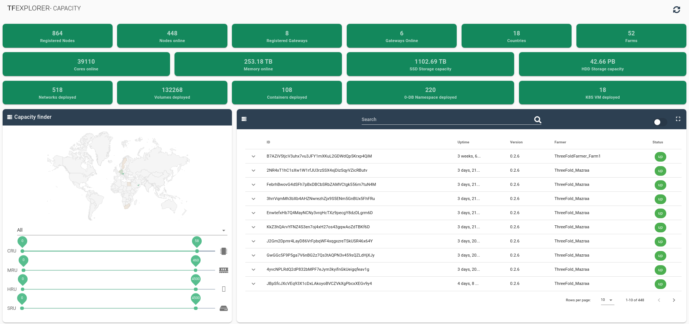

## Project: TF Grid User Interface

The interface to the TF Grid is called Explorer. The explorer provides information to groups of people. The first group is a generic group.  These are people that want to see some of the aspects of the TF Grid and explore.  The interface can be found [here](https://explorer.grid.tf/).  The interface look like this:

The other group of users using the interface are the farmers. The farmers need an interface so they can manage aspects of their farm.  This interface is farmer (individual or company) specific and can only be accessed through the 3SDK interface.  Please find here a description of how to install the [3SDK](https://github.com/threefoldtech/jumpscaleX_core/blob/development/docs/3sdk/3sdk_install.md)

The interface in the 3SDK environment looks like this:

Both interfaces can be optimised and provide more interaction and more extensive API's.

### Purpose
To provide better user interfaces for users and farmers of the TF Grid.

### Funding
See roadmap

### Team

[The ThreeFold Tech team](https://www.threefold.tech)

### Roadmap

Roadmap and investment plan for the 3Bot connect app.

| Name         | Date   | Description | Funding |
|:-------------|--------|-------------|-----------------|---------:|
| V1.0 |  2020/05 | Exporer and 3sdk interface for grid management interactive | 1,000,000 TFT |