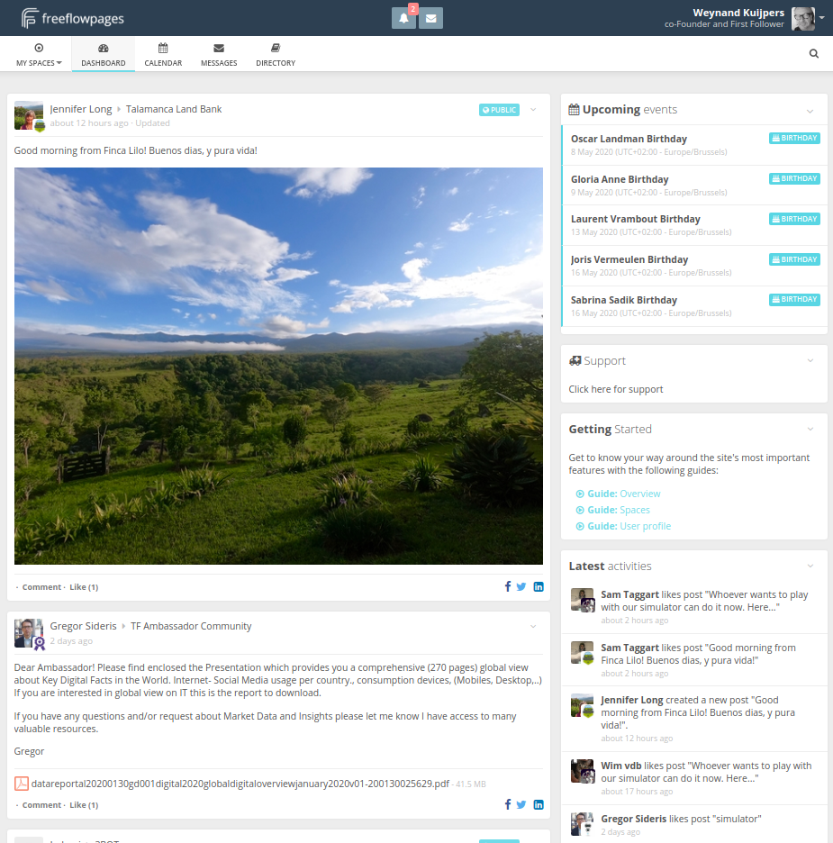

# Project: Social Media

Most social media platform are owned and operated by centralized companies. This allows them to track and trace the users for their behavior and usage and collect data about what their platform is used for. There is proof that certain social media platforms have up-to 20,000 data points per user.  There have been several news reports and movies created on the topic that this can leads to the manipulation of user information to influence populations.

ThreeFold believes in social media but only if approached in a different way.  While centralized platform like Facebook, Instagram and Linkedin store user data on their behalf and therefore gain access to that data - why not build a platform that enables users to store their data and allow them to decide with whom to share their data with. In the end the same results, a social platform where people interact and exchange experiences but where people remain ultimately in control over what happens to their data.

- To create a true private and independent social media platform by people for people.
- We will not just copy Facebook, a design has been made which is more intuitive and new way how to interact with our social network.
- This application will be a combination of multiple ideas: Linkedin, Facebook, Slack, ... and would be very exciting for all of us.

### Status today

- [Here](https://freeflowpages.com/dashboard) is an example of the software implementation being used for [FreeFlowNation](freeflownation.md).
- While already being independent and untraceable, it is not fully peer-to-peer yet.
- User experience must be improved to be able to match current social media standards in regards to user experience. 
- If you need any more information you can contact us over chat on the Threefold website.

### Social Media experience will be on 3bot

See [3bot main page](3botproj).

### Team

- The funding raised for this project will be used to fund open-source developers to create the required software for this purpose.
- There are multiple teams identified how this might happen, the Foundation will oversee the further creation of this project.

### Road map

| Name         | Date   | Description | Funding Requirement |
|:-------------|--------|-------------|---------:|
| V1.0 |  2020/12 | Peer2Peer social media platform by people for people | 2,000,000 TFT |

### Architecture Overview

