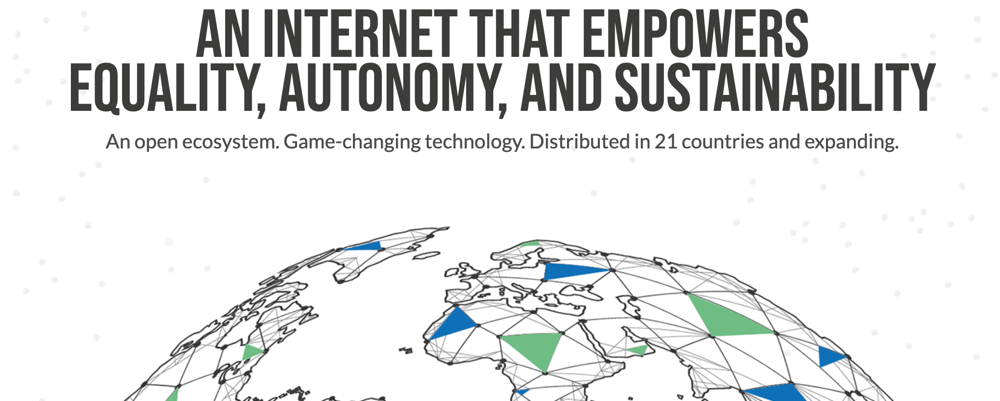

## Token Distribution Event For ThreeFold Grid Use Cases

> _Note: If you're interested in participating in the Token Distribution Event, please visit the Token section of this wiki, and in particular "How to Buy."_

### Introduction

The TFT, is the token of the new internet and has been created 2 years ago, ThreeFold farmers have been providing a lot of capacity since then.
We did not do any ICO or other token creation event. Every token is the result of farming of Internet capacity.

We started with our token on our own blockchain but are now moving to the Stellar payment network. ThreeFold farmers have donated 70m TFT to our Foundation.

We are organizing a Token Distribution Event on Stellar and 2 public digital currency exchanges, to benefit projects (listed below) which have as purposes to provide value to the ThreeFold movement and to do good for our planet. 

### Project Funding

You can buy our ThreeFold token on 2 public exchanges (end May), existing farmers or through Stellar. Its a very easy [process](how_to_buy_and_sell.md).

By buying tokens, you directly support these projects and therefore the growth of the ThreeFold Grid and its experiences. 
Its very easy to [buy these TFTs](how_to_buy_and_sell.md) and as such become part of the larger ThreeFold experience. 

### How Does It Work

You can [buy](how_to_buy_and_sell.md) TFT directly or you can also choose to buy a token directly for a specific project, this allows you to decide where the benefit goes of your TFT purchase. 

We will launch the branded TFT's 10th of may. Each branded TFT is exactly the same as the original TFT.
Its just a different name for the same token but the benefits of your purchase on the Stellar exchange goes directly to the wallet of that specific project.

Any non branded TFTs purchased during the TDE will be distributed according to the pie chart above.
Please do note, we are on a public exchange the Foundation offers these TFT at 0.15USD during May & June, any other TFT owner can also sell at their own conditions.
There will be a maximum of 70m TFT tradable during that period.

> Important note: TFT’s are not an investment instrument. 
> This is not an ICO or IEO, all tokens are the result of previous farming (mining) activities done by the ThreeFold farmers and sold on public Exchanges.

### project overview

| Project Name | TFT Available | Description |
|:-------------|---------------:|:------------|
| [TF Foundation](foundation_readme.md)	| 30,000,000		| Foundation funding (marketing, operations team, grid roll out, roadshows, ...) |
| [3bot (Digital Twin)](3botproj.md)	| 10,000,000		| 80% of our digital life implemented on top of the 3bot |
|[TF Grid enhancements](gridenhancements_readme.md)	| 10,000,000		| Further improvements to the grid as sponsored by the TF Foundation |
| [Crystal Language](crystallang_readme.md)	| 5,000,000		| Core language used to implement the 3bot and future SDK for ThreeFold |
| [P2P Education](education_readme.md)	| 3,000,000		| World's first true peer-to-peer education system on top of TF Grid |
| [3bot Files](3botfiles.md)	| 3,000,000		| Our personal cloud on the TF Grid |
| [TF Grid Solutions](gridsolutions_readme.md)	| 2,500,000		| Open source solutions ported to the grid |
| [freeflow connect](3botconnect.md) 	| 2,000,000		| Peer-to-peer video conferencing |
|[3bot Marketing / Prod mgmt](3botmarketing_readme.md)	| 2,000,000		| Bring the 3bot alive as a digital twin |
| [3bot Browser](3botbrowser_readme.md)	 | 2,000,000		| Personal browser running close to our 3bot |
| [Social media / Collaboration](socialmedia_readme.md) | 2,000,000		| Combination of social media / productivity & collaboration tools |
| [TF Grid User Interface](griduserinterface_readme.md)	| 1,000,000		| Easy-to-use interface to provision IT workloads on the grid |
| [Virtual Reality Museum](vrmuseum_readme.md)	| 500,000		| Virtual reality museum online of 500.000 artworks as part of TF Grid |
| [TimeBank](timebank_readme.md)	| 333,333		| World first global time token, on top of TF Grid, +200k users today |

