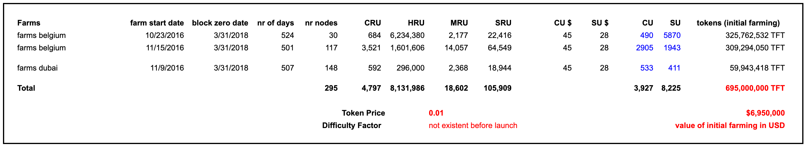

# Genesis Pool

End march 2018 ThreeFold launched the public blockchain.

ThreeFold developed their own blockchain software called **Rivine**, which was probably the first proof of blockstake blockchain in the world. We did not like the way how the other blockchains at that time were doing proof of work which is basically burning a lot of energy to prove the validity of their blockchain.

Rivine was a fork from the blockchain work done by the team of Sia and since then a lot of work has been done on it to fulfill our own requirements. The Rivine blockchain will no longer be used after May 2020.

ThreeFold is the result of more than 20 years of work in the internet space over a number of companies. The technology used at start in March 2018 has been developed mainly out of 3 companies: [ThreeFold FZC](threefold_fzc.md), [Bettertoken](bettertoken.md) and GreenITGlobe. Later in 2018 TFTech was spinn off from our incubator.

[TFTech](tftech.md) is a company born out of our Incubator called [Incubaid](http://www.incubaid.com/) in Belgium. TFTech has as purpose to further develop the software and commercialize the capabilities on a global basis, mainly by working together with tech partners.

The public version of our blockchain has been started March 2018.

Many hundreds of servers have been used to develop the technology which now makes up our ThreeFold grid. We took 300 of them and used those as the basis for our farming. In above overview you can see the makeup of the genesis pool.

Please note that all tokens in the ThreeFold grid are the result of farming, also here in the genesis pool, there is a direct relationship between hardware (servers) who produce IT capacity for years and the tokens farmed. The genesis pool was the first pool of hardware.

The rules of farming see [farming rules v1](farming_rules_v1.md) have been applied on the genesis pool. The value at that time 2017+ was almost 7m USD for the farmed capacity in the genesis pool, since then this value has increased substantially.

## The Genesis Pool

[photos genesis pool](structure/images_threefold_genisispool_dubai.html ':include :type=iframe width=100% height=550px frameBorder="0" scrolling="no" align="center"')

Most of the servers are in Dubai and in Ghent Belgium.

### what happened with these original tokens

