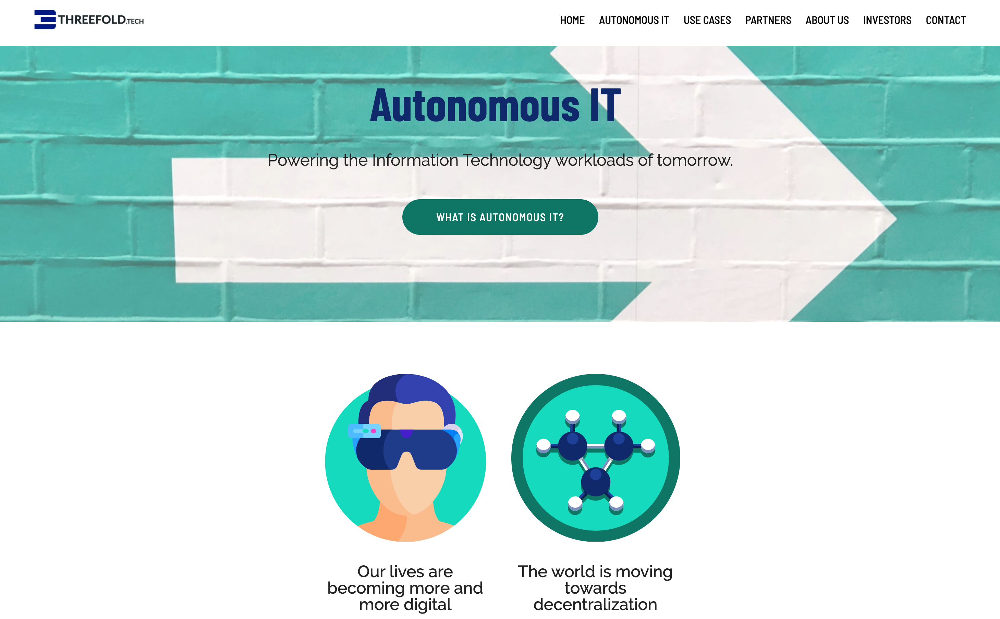

# ThreeFold Tech

Has developed most of the software as used in the threefold grid.

Company developing & promoting software for self-healing, self driving cloud & blockchain workloads

- TFTech is working together with industry partners to sell its software
    - major partners: HPE, Solidaridad, Kleos, ...
- Income
    - License and OEM agreements involving the TFTech technology:
        - License fees can be in the form of a revenue share on commercial products being developed on top of the TF platform. 
    - With respect to the TF Grid, a fee of 10% of revenue generated is charged
for as a license fee for certified edge cloud capacity registered on the TF Grid
network
- Investors to this point:
    - Self-funded by founders & current funding round

see https://threefold.tech/

We believe that doing good for the world and growing a successful software company can go hand in hand.

## shareholders

|   | description  |
|---|---|
| private investors CLA  |  +- 12.5% of company, by means of convertible loan |
| private investors shares |  +- 7.5% of company, already converted loan to shares |
| founders |  22% of company |
| freeflow not for profit foundation |  58% of company |

Above is the the expected shareholder distribution sept 2020.

## location

