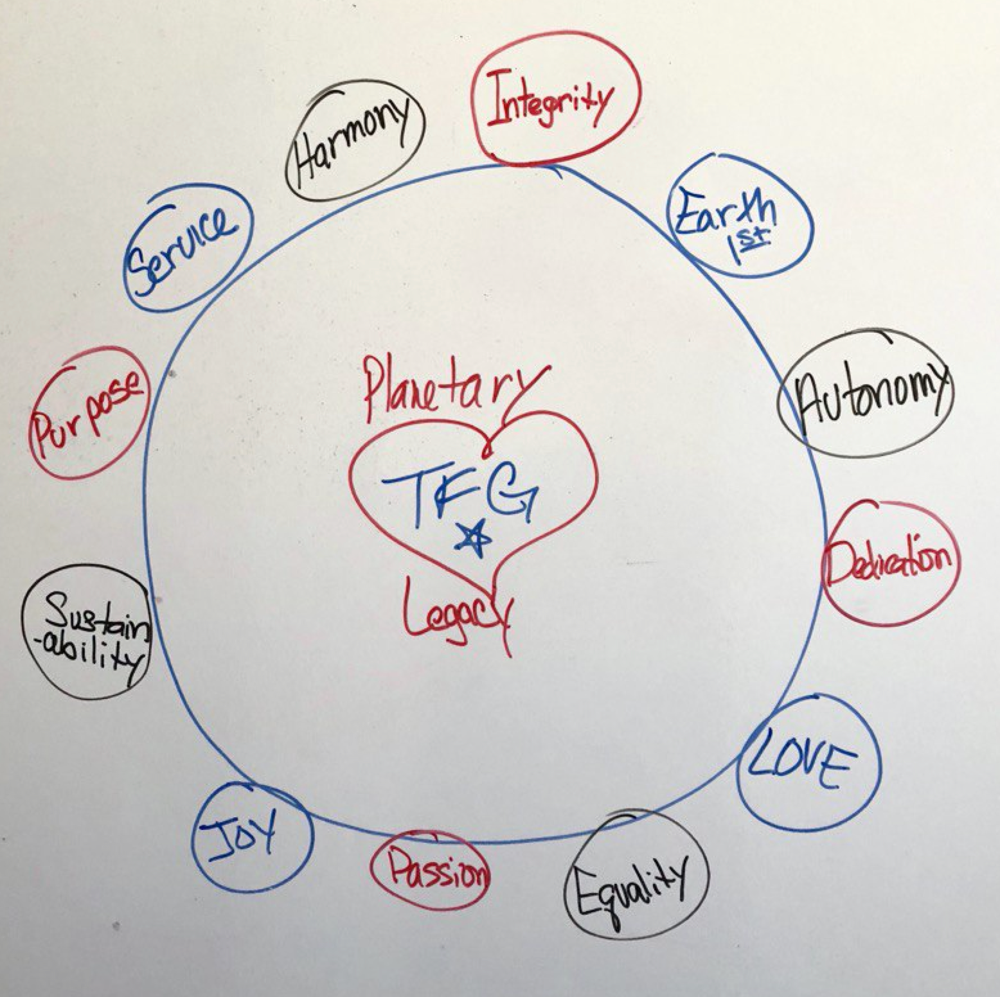

# ThreeFold Wisdom Council

ThreeFold Foundation receives through the blockchain 10% of all capacity sold on the Threefold Grid. These proceeds are used to further develop the ThreeFold Movement and later to benefit planetary doing good projects

12 members have following function

- protect the interests of the ThreeFold Foundation
- approve TFT donations to doing good projects
- oversee the way how the ThreeFold tokens are used to benefit the planet and the ThreeFold movement.

One of our members came up with following crystal grid.

