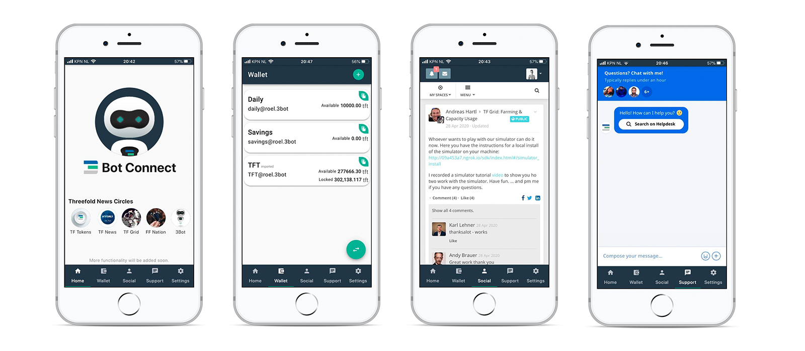
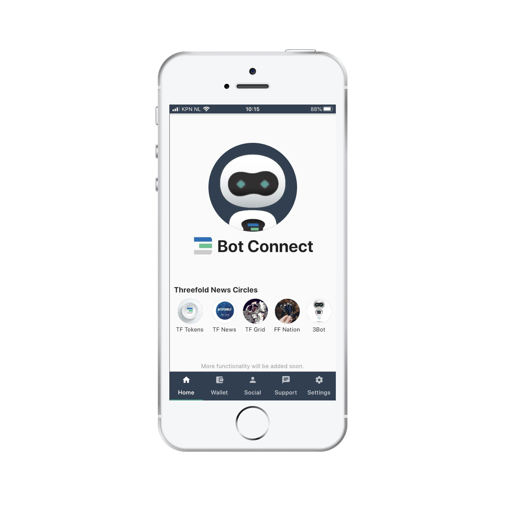
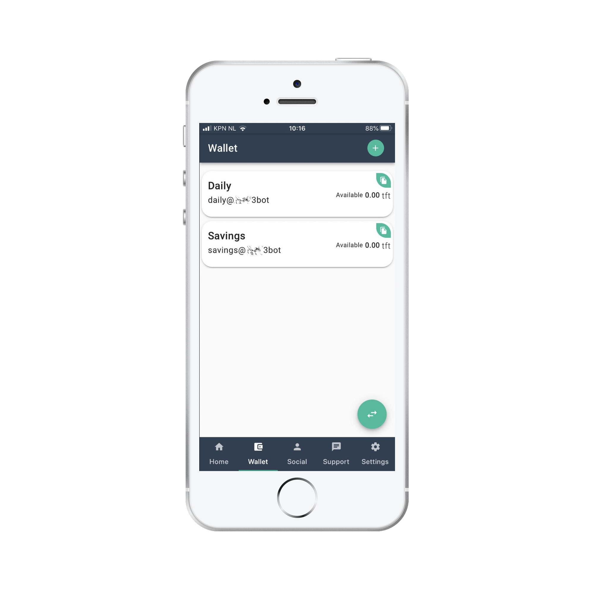
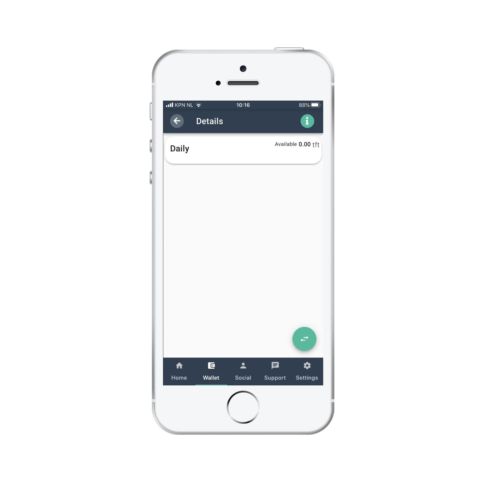
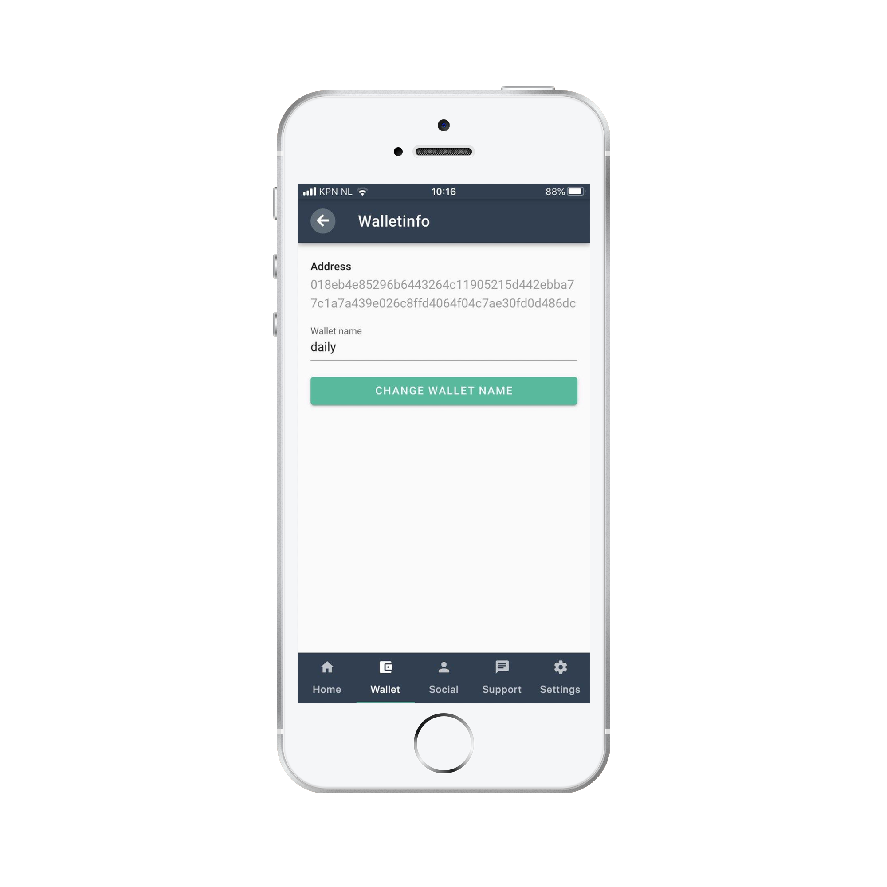

# 3Bot Connect App

## Introduction

3Bot Connect is a app that is more than just a wallet. It is:
- A wallet to hold digital currencies
- 100% private two factor authenticator
- Mobile gateway to Freeflow pages
- Mobile access to TF support chat

## Download

3bot connect is avaible both iOS devices and Android devices.

[Download 3bot Connect for iOS](https://apps.apple.com/us/app/3bot-login/id1459845885)
[Download 3bot Connect for Android](https://play.google.com/store/apps/details?id=org.jimber.threebotlogin&hl=en_US)

## Registration and login
  
  To use the 3Bot Connect App you simply need to download the 3Bot Connect App available in the Appstore or Google Play Store. Folow the steps and register using your email address.
 
 ### Save the seed phrase in a safe place. In the future, it may help to restore your wallet in case your devise is lost.

Seed Phrase allows you to access and recover your wallet from any device. 
We highly recommend write down your seed key on a paper and store it safely offline.

> **3Bot does not have any access to or maintain records of your private key. It is your personal responsibility to keep your 24-word private key in a safe place.**

> **Do not share your private key with anyone, it is strictly personal. Losing your private key means losing access to your wallet and all your ThreeFold Tokens.**

> **Anybody with access to your private key can take ownership of your 3Bot Connect wallet and ThreeFold tokens**

> **To access your wallet from another wallet (on another phone or online) you will need your private key (seed), without this private key your account cannot be recovered on another device or online wallet.**

Finish this steps and choose your new pin, then confirm it and confirm your e-mail adress.

## Home Page

This is the Home Page of your 3Bot Connect App. From here you there are shortcuts to open Social - [FreeFlow Pages](https://freeflowpages.com/).

## Wallet

In this tab you can check your ThreeFold Tokens wallets and balances. You can copy your wallet address using the green "Copy" buttons for each specific wallet. Using the button in the bottom right side you can send or generate QR code to receive ThreeFold Tokens:

### How to get your wallet Address
#### Step 1

Click Wallet in the main nav bar at the bottom of the screen.

#### Step 2
Click the wallet you would like to see the adress from (if you want to copy paste the address you can always use the green button with the white copy icon in the topright part of you wallet block)

#### Step 3
Click the green button with the Info (i) icon in the top right part of your screen

#### Step 4
You can now see your wallet address.

### Generate QR Code to receive ThreeFold Tokens

To recieve your ThreeFold Tokens you can copy your button or you have to fill next fields:

1) To - choose wallet that get transaction
2) Amount - amount of TFT to get
3) Message - message to transaction
4) Generate QR - this button generate QR that you have to show

### Send

1) From - choose your wallet with TFT to make transaction
2) To - paste the reciever wallet adress
3) Amount - amount of TFT to send
4) Message - message to transaction
5) SCAN QR - or just scan QR and this fields will be filled autromaticly

## Social
  
In social tab you can join to our FreeFlow network, get actual news from official pages of ThreeFold communities. You can also create your own communities. Home page contains links to the specific ThreeFold communities. 

You can find available circles by pressing "My Spaces" -> and start typing a name or select from the proposed list.

## Support
Here you can receive support on any questions related to ThreeFold.

## Settings
You can check your Secret Phrase here, change your pin code or remove your account in Advanced Settings tab.
