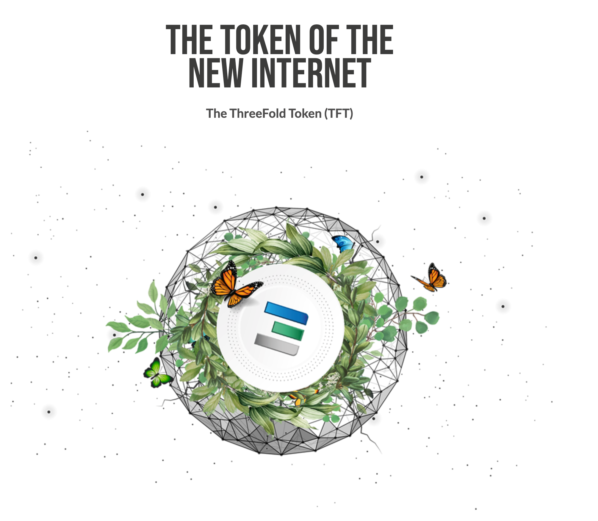

> **IMPORTANT:**
> TFT's are not an investment instrument  
> TFT's are the digital currency of the new internet.  
> With TFT's you can buy IT capacity or other internet services on the biggest peer2peer cloud in the world called ThreeFold Grid.

Starting beginning of may, we will be promoting the launch of our 2nd generation grid and the TFT. If you want to support this project do buy tokens please, you are helping to create a new conscious internet.

## Token Launch Event

- +-70 m tokens are available to buy
- The ThreeFold organization organizes a token launch event to celebrate the public launch of the new conscious internet. [Please read more here](token_launch_event2.md).

## How to buy the ThreeFold Token (TFT)

### Stellar Ecosystem

- [Interstellar](tft_interstellar.md)
- [StellarX](tft_stellarx.md)
- [Lobstr (wallet)](tft_lobstr.md)

There are many credit card options to buy XLM (the stellar native currency needed before you can buy a TFT, many take rather big fees).

### Available From ThreeFold Farmers

- [TF Farmer Mazraa With Credit Card](tft_mazraa.md)
- [TF Farmer Mazraa With BitCoin](tft_with_btc.md)
- [BetterToken](bettertoken.md)

> You can buy TFT on any exchange, when you use TFT to buy capacity from a Farmer,
> in  most jurisdictions VAT needs to be paid for e.g. in Europe normally 20-22%

### Liquid & BTC Alpha Exchange

- [liquid](tft_liquid.md)    
- [btc alpha](tft_btc_alpha.md)

> Available Mid-Late May
