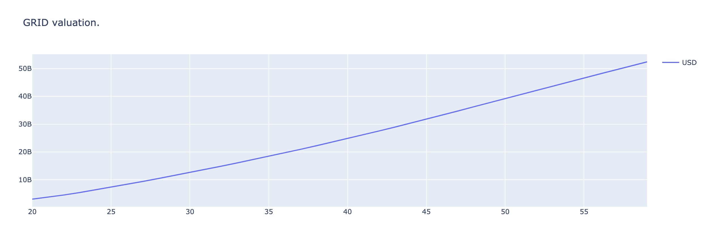

## Tokenomics

### How it all works

A ThreeFold Token (TFT) is only created when compute and storage hardware is added to the ThreeFold Grid. We call this mechanism Proof of Capacity (PoC).

The indivuduals or businesses contributing to the ThreeFold Grid by adding hardware nodes are the farmers of the compute and storage capacity who are rewarded in TFT.

The only way to rent the compute and storage capacity on the ThreeFold Grid is through TFT.

### Setting the Scene

The ThreeFold Foundation set in alignment with the ThreeFold community the total amount of 'farmable' TFT to 4 Billion.

Those 4 billion TFT allow farmers to ad 2 million hardware nodes to the ThreeFold Grid.

### ThreeFold's Market Potential

The ThreeFold cloud technology is designed to be peer to peer, close to the user and does not need a high end datacenter to live in.
This means with our technology we can bring internet capacity - compute and storage - to the 3 billion people who have no access to it so far on our planet.

Looking at the amount of people this technology can serve a 10% market share of the Public Cloud market of 500 billion USD by 2025 looks more than realistic. ([IDC ww public cloud market forecast](https://www.idc.com/getdoc.jsp?containerId=prUS45340719))

This equates to about 75 million nodes ddeployed on the ThreeFold Grid globally.

### The near term Market Share Goal

With the 2 million hardware nodes the ThreeFold farmer community plans to deploy in the next 5 years a 0.5% market share in the Public Cloud Market can be achieved. This would mean that TFT in the value of 2.5 billion USD will be spent by 2025 to reserve cacacity on the ThreeFold Grid.

### The Value of the ThreeFold Grid

Using a TFT price of 3 USD for this simulation the martket cap of the ThreeFold Grid would go up to almost 13 billion USD. That type market can brings the ThreeFold Nework into the to 20 most valued blockchain companies. ([Coingecko](https://www.coingecko.com/en))

At a for a hosting business realistic 30 times revenue valuation the ThreeFold Grid would generate 50 billion + in valuation. 

If you want to see more details on the simulation model and play around yourself click [here](https://sdk3.threefold.io/#/simulator_install)
