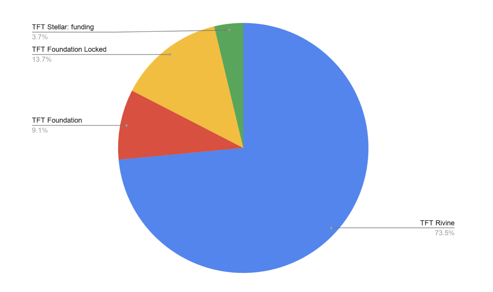
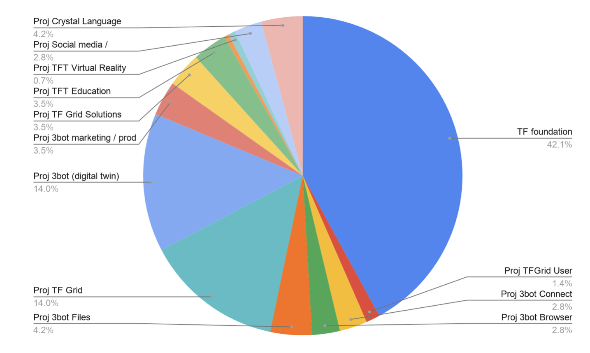

## Token Overview

### Overview Token Today

| Type  |      Amount    | 
|----------|:-------------:|
| TFT Rivine |  590,635,311 |
|TFT Foundation |    98,000,000   |
| TFT Foundation Locked | 10,000,000 | 
|TFT Bootstrap Stellar |   5,000,000  | 
| TOTAL AMOUNT OF TOKENS | 803,635,311 |

### Overview Token at Launch

| Type | Amount| Blockchain |
|-------|--------|---------|
| TFT Rivine | 590,635,311 | Rivine |
| TFT Foundation | 73,000,000 | Rivine |
| TFT Foundation Locked | 110,000,000 | Rivine |
|T FT Stellar: funding |30,000,000|TFT Liquid on Stellar: foundation funding|

### Overview Token On Stellar May

