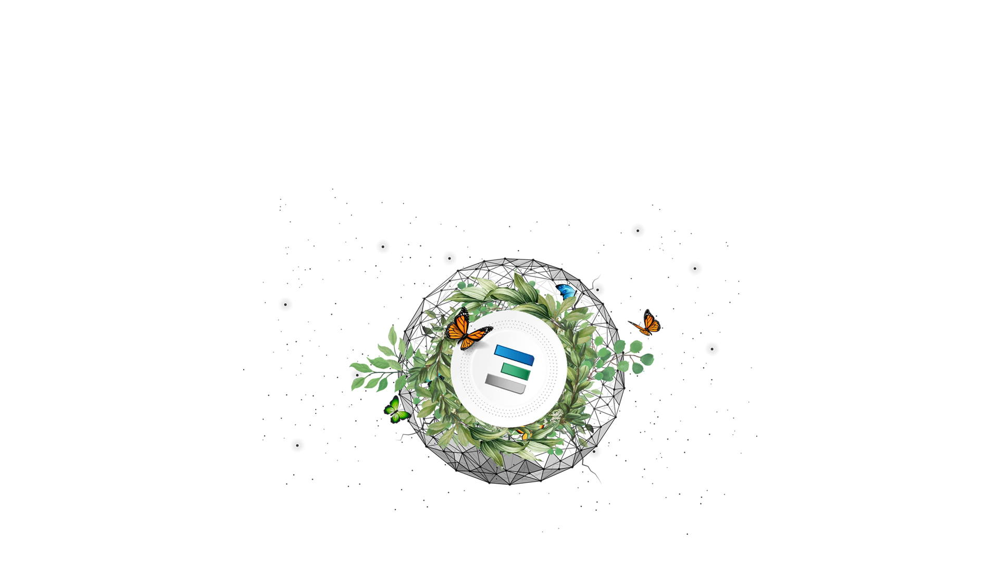

# Why does ThreeFold need its own currency?

For most parts of our everyday life, we use fiat money to exchange goods and services - a centralized currency issued by a central bank. 

###  So why don't we follow this convenient and familiar path for ThreeFold?

Because the value of the ThreeFold Grid and its use-cases is largely provided by its [decentralized](true_decentralized_internet_system.md) nature. We believe in the power and autonomy of individuals to be able to collaborate in a peer-to-peer system, where everyone participates with equal privileges.

The beautiful [ecosystem](info_threefold\src\partners.md) that we are creating would be incomplete without a decentralized currency as a fair and trustworthy medium of exchange for all stakeholders. TFT allows our whole ecosystem to enjoy the [benefits and the fairness](token_what.md) of a decentralized currency. That's why we created the ThreeFold Token (TFT).

***Important note: TFT’s are not an investment instrument.***
