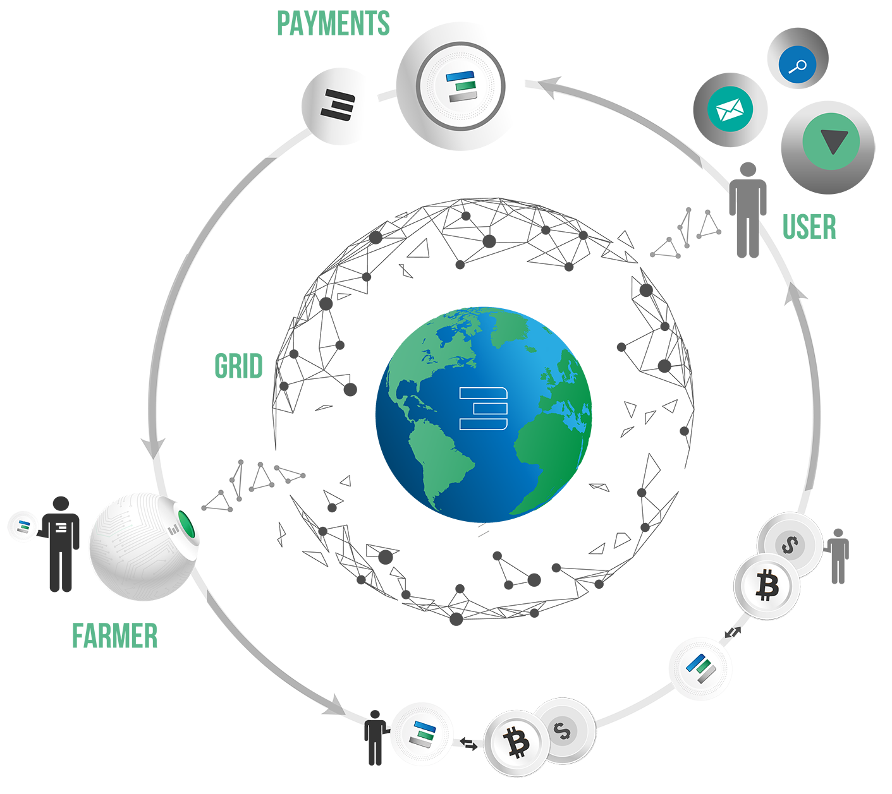

# TOKENOMICS WIKI

# Threefold Tokenomics In 4 Easy Steps

Step 1. Farmers rent capacity to the ThreeFold Grid and get TFTs in return.

Step 2. Farmers exchange their TFTs for other crypto or fiat currencies. Users exchange their fiat or crypto currencies for TFTs.

Step 3. Users reserve capacity with TFTs, they pay farmers and part goes to the foundation.

Step 4. Grid provides the reserved capacity to the user and the user can deploy the workload.		 

# Earning Tokens

The ThreeFold Token has developed in a way that it incentivizes the growth of the ThreeFold Grid. 

Each farmer has two streams of TFT income:

# Farming

**PROOF-OF-CAPACITY**

When a person puts capacity on the ThreeFold Grid, this process is called Farming. To incentivize farming, the farmer will be remunerated a certain amount of tokens for doing so. 

The number of tokens the farmer earns is dependent on multiple factors:

** Server/Node Specs of the Farmers Hardware**

* Compute Capacity (CPU)

* Memory Capacity (RAM)

* Storage Capacity (SSD/HDD)

These factors combine to a Cloud Production Rate (CPR). The higher the CPR, the more tokens are earned.

**Grid Specs (This is the same for all farmers at every point in time)**

* Farming Difficulty (the actual difficulty factor determining how fast TFT’s are created through farming)

# Cultivation

Anyone can run applications and workloads on top of the ThreeFold Grid. Capacity can be reserved from the Farmer who has made this capacity available on the ThreeFold Grid. This payment for capacity will be made in ThreeFold Tokens. Cultivation incentivizes farmers to create capacity where it is needed most by rewarding them when that capacity is used.

# Support Of The Threefold Foundation 

In order to promote the growth and development of the ThreeFold Grid, a percentage of all cultivation transactions goes to the ThreeFold Foundation.

This percentage equals 10% at the moment. After 24 months of farming, it will go down to 5%.

