<!--- TODO: Have Kristof check if this is still needed when we have autonomous layer WP online as well, seems like ther is a lot of overlap --->

# ThreeFold Tech the first 100% Decentralised Solution

# Introduction

TF Tech is a software company who has developed technology capable to build a 100% decentralized internet. This document describes how the TF-Tech 3bot technology can make this happen.

 If you want to read more about why does the world need a decentralized internet, [read this document.](https://docs.google.com/document/d/1uZT03h4QLBh2RYEnUjZQvi2Xoy8fjbUn1eZN_PM8g6g/edit#heading=h.c63i1qgi1v9h)

# Decentralized = different centralized.

De-centralized has the word centralized inside but in a different way. The idea is not to make an organization or group of people the owner of a centralized system but rather the other way around, you or any legal identity becomes the center of your own digital life. More like how cells work in our body, all together we create a functioning world, by collaboration.

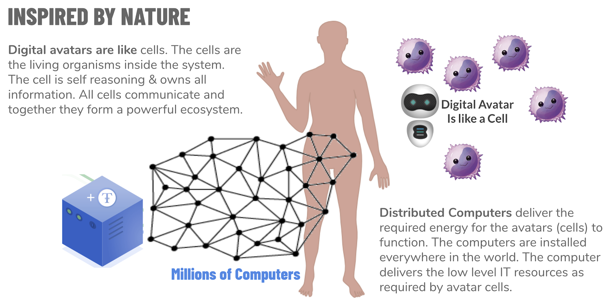

Each human person or a legal entity owns one 3bot. This is the main 3bot you interact with, this 3bot can own other 3bots. A legal entity can be a trust, a company or a government department. 

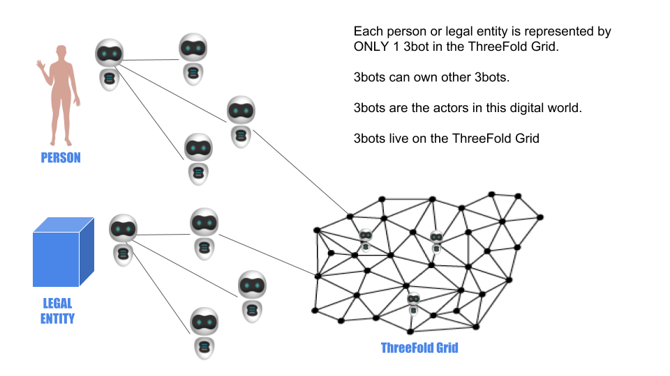

3bots (the digital avatars) are the actors inside such a system. All data is owned ONLY by 3bots who are OWNED by the aforementioned legal or person entities. All 3bots need to be registered in a digital phonebook (implemented by means of blockchain technology).

To let such a system work each 3bot needs to have full control over the required IT resources for any application or service the digital avatar needs to run.

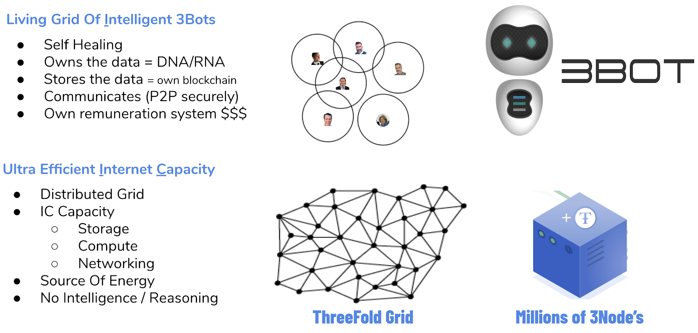

Each entity (person or legal entity) can define multiple circles. These circles define how we interact with other 3bots (access rights, searchability, …). 

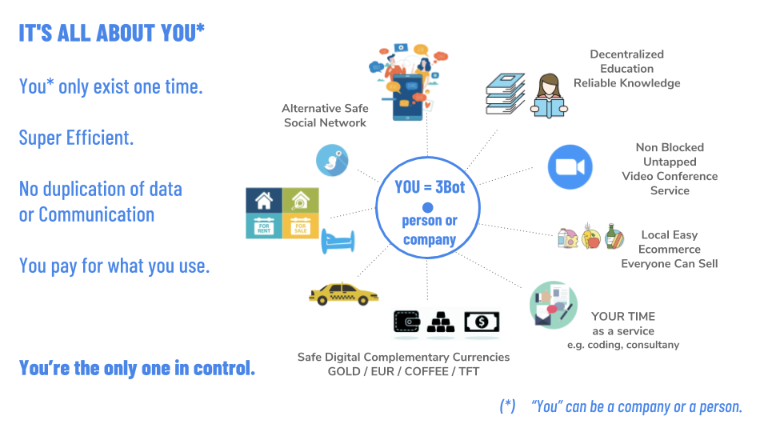
	

## A circular decentralization solution is more sustainable. 

Everything is a balance between efficiency and resilience. (more info see “[the world needs a decentralized IT solution](https://docs.google.com/document/d/1uZT03h4QLBh2RYEnUjZQvi2Xoy8fjbUn1eZN_PM8g6g/edit#)”). In our current society, the focus is too much on efficiency which has lead to too centralized systems. Centralized systems are too fragile (boom-bust cycles) and can lead to abuse as well (we became a product in centralized data management systems e.g. Facebook, ...). 

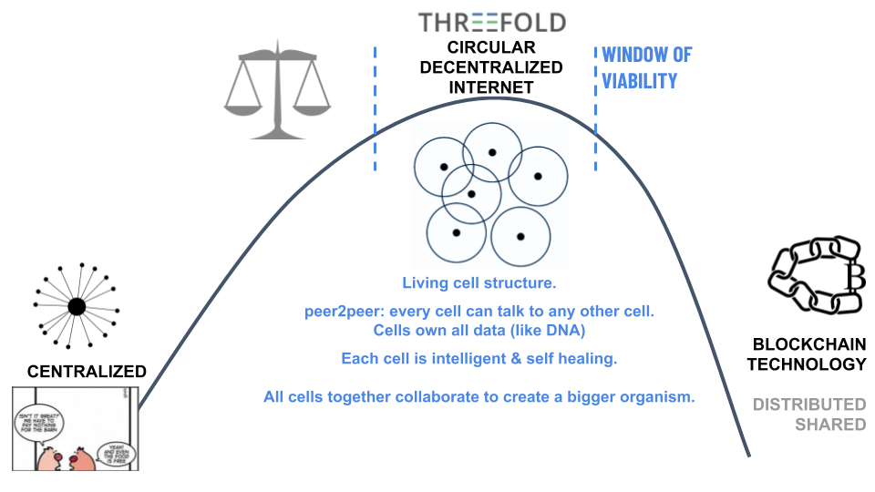

A new system is required which allows the world to function in a more decentralized way. Current Blockchain or Centralized server systems are the outer sides of this curve. 

A new system is needed with the right balance between centralization and distribution this is the true form of decentralization. We believe the right form is like a circle where we (or any legal entity) are the “center” of the de-**central**ized world. Blockchain technology is used inside your center of the circle (which we call a digital avatar) as well as finding consensus in between the circles (digital avatar). The combination of both concepts makes a sustainable, viable solution possible.

This solution would sit in the sustainable part of Bernard Lietaer efficiency vs resilience graph.

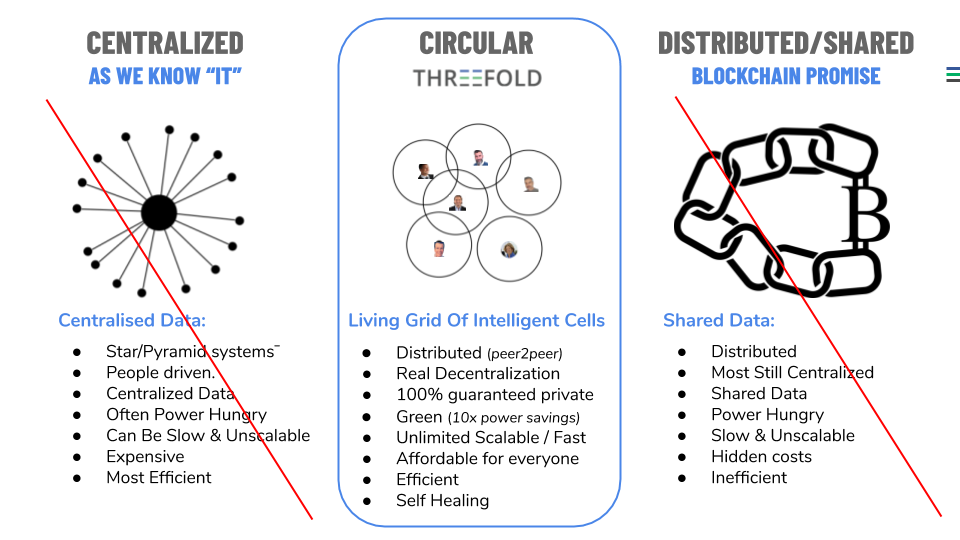

## Circles define your communities

Circles are the groups you define to share your information with.

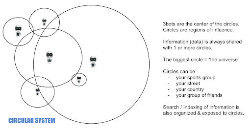

There is 0% centralization in this system. Blockchains are being used where a shared state is required.

# 3bot = the center of your digital “de-centralized” life 

Your Digital Avatar = the “3bot” has been designed to be as efficient as possible. The current memory footprint is less than 200 MB yet still it is a wiki system, database, blockchain, web server, indexing & search machine, e-commerce system, wallet, decentralized exchange, … It can manage millions of objects and is the center of your company or you’re digital life.

To create this 3bot we had no choice than to restart from scratch and re-invent a lot because existing IT components are too centralized and often too inefficient (e.g. memory hungry).

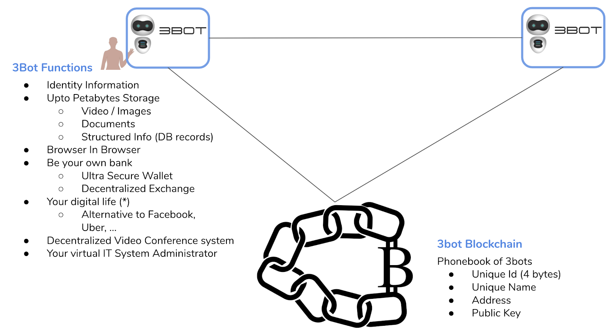

## ThreeFold Blockchains

### 3Bot Blockchain 

Acts as the phone book. Each 3bot has an entry in this phonebook.

The following information is stored there

*   Unique global ID (is a nr)
*   Name (a name e.g. kristof.ibiza)
*   Address  = address which allows other 3bots to find your 3bot.
*   Public Key = important to establish secure communication between 3bots.
*   Generic Usable Data Field

### TFT or any other digital currency Blockchain 

Is the blockchain managing the ThreeFold Grid main currency

This same blockchain technology can be used to manage any type of digital currency.

### TF Notary (also called BCDB = BlockChain DB) 

Is the digital notary system in which all digital records can be stored.

Eventually, there will be more than 1 TF Notary blockchain to allow scalability of the system.

The following information is stored

*   Unique global ID (is a nr)
*   A chosen name e.g. can be a GUID or a name per node, is free field, is like a DNS name. The blockchain makes sure this chosen name is unique
*   Address  = the 3bot who owns this registered information (optional)
*   Data field which has the info to be registered can be any format but max 2000 characters in size.

### TF GRID Directory 

Is the registration of all farmers and nodes inside the ThreeFold grid.

  information is stored

*   Unique global ID (is a nr)
*   A chosen name e.g. can be a GUID or a name per node, is a free field, is like a DNS name
*   Address  = the 3bot name who represents this node
*   Data field which has info about the node.
    *   Farmer ID
    *   Capacity  (resource units)

## How is data stored

In most distributed systems, data is stored multiple times to guarantee redundancy.

This leads to a lot of overhead and is also not the most secure mechanism.

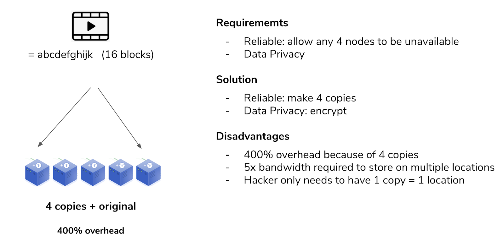

### The “Space Algorithm” of storage 

The ThreeFold system uses dispersed storage algorithms and is very different in nature.

In a dispersed storage system the data gets dispersed in such a way that data will always be available even if 4 sites of the 20 (in this case) would not be available. Redundancy is the same as in the above example but the overhead is 20x less, it also has clear benefits from a security and efficiency perspective.

This has been originally invented for communication in space.

### How is this “Space Algorithm” used by the 3bot. 

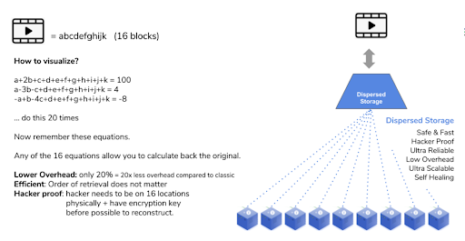

By nature a 3bot is stateless (has no own data storage). A 3bot owns digital currency (TFT) which the 3bot can use to reserve raw storage and compute resources on the grid.

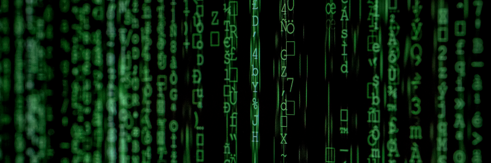

Each 3bot has a unique capability to use this CPU and STORAGE capacity from the different TF nodes in the TF Grid in a safe and reliable way. Data cannot be lost because of the above described dispersed storage algorithm.

A 3bot can store a petabyte of information as long as enough TFTs are available so the required resource can be reserved on the individual TF Nodes. 3bot is the only entity which has the required information and keys to make retrieval of the distributed data possible.

## We need a more efficient information retrieval system 

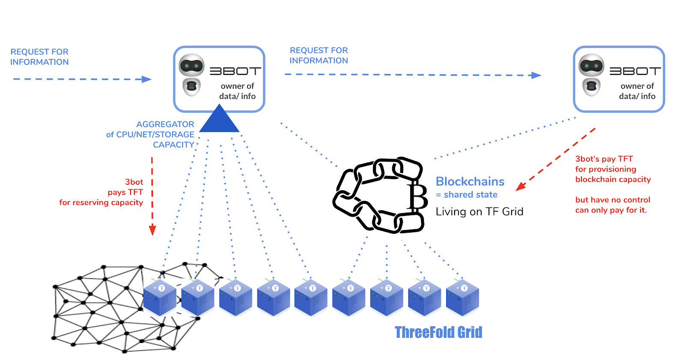

In current internet retrieving information happens in 2 ways

**Centralized**

*   Based on a URL (a unique resource locator e.g. ) which is typically rather long.
*   A URL can only be used in a centralized context. It has been designed for that purpose.  \
Example url: _https://images.unsplash.com/photo-1555434992-f1670f5e8fce?ixlib=rb-1.2.1&ixid=eyJhcHBfaWQiOjEyMDd9&auto=format&fit=crop&w=934&q=80_
*   Today +99% of all information is stored this way.
*   You have to rely on the provider of the information (normally not the author) to deliver good uptime and enough connectivity to the internet

**Distributed** = blockchain or other distributed database

*   A long key e.g. 32 characters or even 64
*   The data is distributed (sometimes replicated) over big area’s, the data is not linked to author but spread over large area controlled by a blockchain or by a centralized application.
*   The lookup process typically is slow,  a special algorithm allows you to find the information in multiple steps, there is no guarantee that the data is close to you when you need it.

In the suggested circular decentralized system there is only need for 2 numbers to retrieve any information in the world. One number is the find which digital avatar to talk to, the other number is to find the information in the digital avatar of the data owner (can be a legal entity or human person).

Information can be a movie or a single piece of information like your email address.

Each digital avatar is responsible for retrieving & reconstructing the information from the underlying IT capacity network (the nodes on a decentralized internet). This happens in a very secure way and the digital avatar is the only digital entity capable of re-assembling the information in such a way it makes sense again. This leads to very good security.

This way of how to address information has far-reaching implications and can change the way how the internet works.

## indexing & search problem

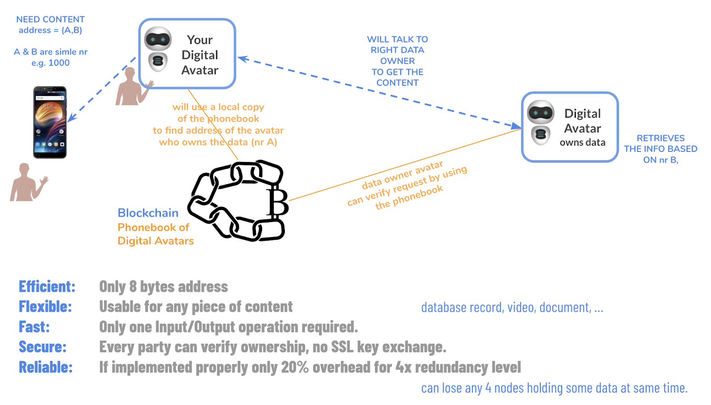

A difficult problem in a fully decentralized system is how to index and search for information.

When an author (in a company or private context) creates content, he/she needs to define access rights to one or more circles. If giving read access to the universe circle it basically means everyone can retrieve the information. Each piece of information also needs to get labels, these are labels you freely choose and not necessarily have a meaning outside of your own environment.

There are some automatic labels like type of document, creation data, location of creation (e.g. photo), …

An author can define which part of the document (if not all) is available for indexation.

In the TF Grid there are aggregation providers which are deployed (paid for) and owned by a specific 3bot.

These aggregation providers list themselves into the aggregator blockchain.

Example aggregators

*   A facebook alternative.
*   An Airbnb alternative 
*   An Uber alternative
*   A football club directory
*   A city merchants organization

Each aggregator is basically a 3bot who got rights to query indexing and/or the information behind.

Each 3bot (as instructed by their owners) needs to inform the required aggregators to index/access the information (in a broad sense: video, address details, documents, news, ...)  as stored in the 3bot.

The 3bot can use a combination of labels and circles to do so.

Example, you create blog articles about food and want to be listed on an aggregator site of healthy food. You found this aggregation site because of consulting the aggregator blockchain (of course there are nice tools available to make this user-friendly). You can now instruct your 3bot to list all your relevant blog articles with labels food & healthy to that aggregator. The aggregator will now receive instructions to index the information and list it in its own application to the intended audience. The aggregator has the right to accept the information or not. The aggregator can make a commercial business out of it and can decide to give part of the income to the original authors of the information using e.g. TFTs. 

Important to note, the information itself does not get stored on the aggregator site, only when creating the index. The required index information is being provided and used to create the index. This means that e.g. sensitive information will stay on the author 3bot only fields relevant for indexing will go to the aggregator.

This system is super scalable because aggregator sites by themselves are limited in scope and do pre-sorting of information people look for. E.g. an Uber alternative only makes sense in a certain region, no point to have a global Uber aggregation site. It's even possible to create aggregators of aggregator sites. \
Sites which make it easy to query information over multiple aggregators.

Any 3bot can decide to pay the required TFT’s to run an aggregation site and register the capabilities and goal of the aggregation site in the aggregation blockchain.

This system makes it possible to avoid centralization completely.

# This leads to endless scalability 

The above-suggested architecture scales endless, millions of digital avatar can work with millions of nodes in the decentralized internet who provide the capacity, the digital avatars are the brain.

# TF Tech Software Components

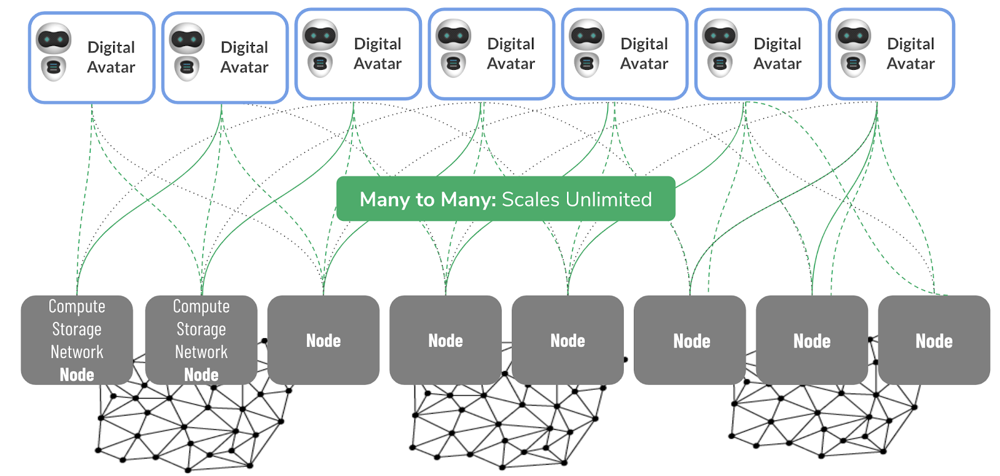

# Workloads (work in progress)

## Phase 1 Cloud Workloads (2019)

*   Docker
*   S3
*   Web gateway = http(s) proxy to any group of containers at the back
*   ZDB service = our own storage service on SSD and HD

+90% of all workloads which can run on Google cloud, Amazon, …  \
can be made to run on the ThreeFold grid.

## Phase 2 Blockchain as a service Workloads (H1 2020)

ThreeFold has resolved the blockchain dilemma problem (see this doc).

We believe in a world of many small blockchains which all serve a specific purpose.

The blockchain as a service will allow any group of people to deploy their own customer blockchain which can be used for digital currencies, digital notary or other blockchain purposes.

Today the TFT (ThreeFold Token) is running as a blockchain on top of our TF Grid.

Our platform is ideal to host other blockchain technologies as well. Our platform is like a blockchain to service other blockchains. We have the capability to resolve the blockchain dilemma problem for blockchains not created by us, because we can deliver scale & privacy for 3e party blockchains.

Our blockchain as a service platform allows anyone to launch a blockchain in minutes while maintaining

*   Privacy (optional)
*   Scale
*   No people needed to manage

## Phase 3: hacker free deployment of apps 

Hackers (security breaches) are a very big issue for most operational companies today.

Building fences around sensitive information will never be safe enough because there are always people having access and people can make mistakes.

What if a system would exist which allows to deploy a workload without involvement of any person. No-one, not the IT administrator, or the person who paid for the IT service or any other person has the ability to influence the operations of the IT workload. 

This sounds probably too good to be true, but in Summer 2019 we will be able to demonstrate this to anyone. This has never been done before.

<!---
## Phase 4: Decentralized Workloads (step by step, apps are being added) {#phase-4-decentralized-workloads-step-by-step-apps-are-being-added}

*   Need content about facebook alternative, decentralized zoom, …
*   These are workloads running on top of our 3bot technology.

--->