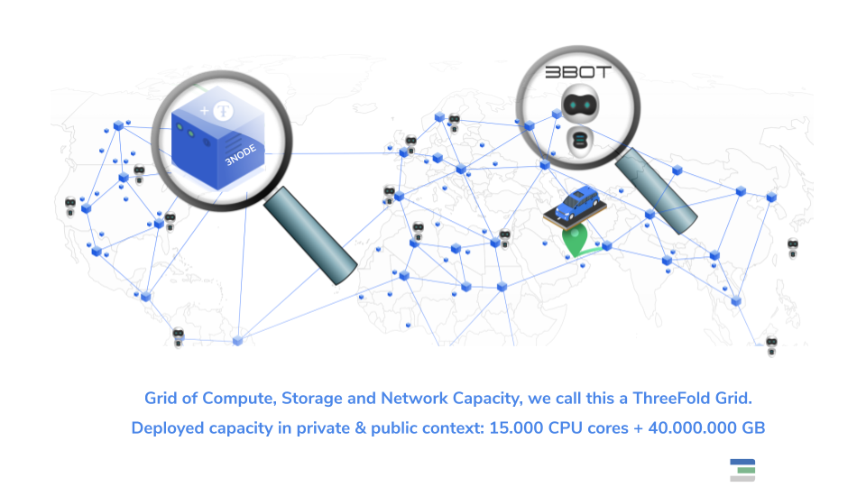

*IT” CAPACITY IS THE OIL THAT FUELS THE DIGITAL ECONOMY*

# ThreeFold Technology Whitepaper: Capacity Layer
 Author: Kristof de Spiegeleer
 Version: 1.0

# Introduction

Today, IT capacity is mainly being delivered by means of centralized cloud technology which gets deployed in a private or public context. ThreeFold Tech has created technology to make the cloud 100% decentralized.

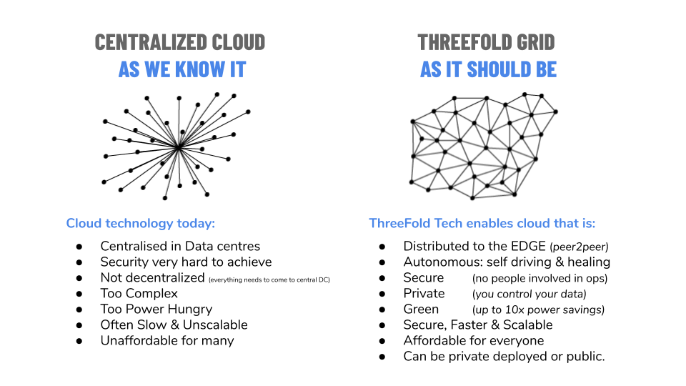
 Our solution has two components: a 3Node, which is the box which can deliver capacity in a very compute/storage and power efficient manner, and the 3bot, which is our “digital self” – it is the decentralized component which makes autonomous IT possible and allows the grid to scale forever.

The 3bots are the coordinators which can run 100% autonomously – they are super intelligent digital creatures who know how to protect your data and how to deploy/manage any IT workload on the capacity layer, which is the grid of the 3Nodes.

# The 3Node 

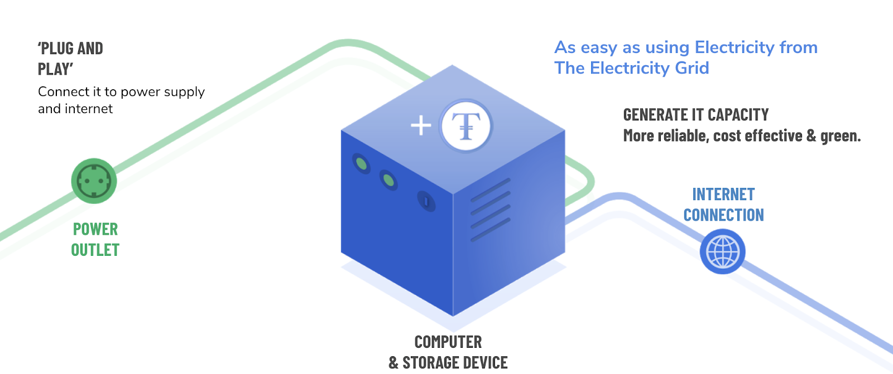

The 3Node is a physical box which is connected to the Internet or a local network. A 3Node can be deployed privately, as well as for high-security use cases. The 3Nodes deliver the required capacity for the TF Grid.

The 3Node boot process is ultra-safe and cannot be intercepted by hackers. It is designed in such a way that no person, not even ourselves, has access to the internals of the Zero-OS.

We do this by means of strong integration with the physical hardware security and boot capabilities (e.g. secure-boot). There is no shell in Zero-OS, no user interface, and no RPC layer (remote procedure call).

The only way how the Zero-OS can be commanded is by means of the Blockchain Database.

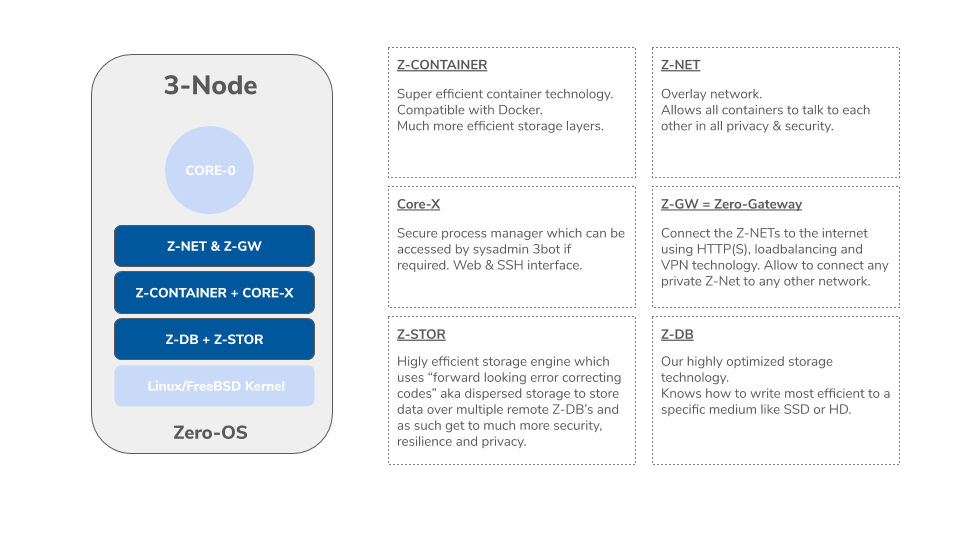

Core-0 is our main process manager which will deploy and manage our primitive workloads. There are three types of workloads: compute, storage, & network.

# 3 Node Primitive Workloads

The primitive workloads which are delivered by the Zero-OS:

<!-- tabs:start -->
##  **Compute = Containers-Based**

The world started with hardware virtualization (virtual machines). It was a big step in the right direction but has lead to many layers of complexity, and total cost of ownership did not get lower. Security is also a big issue.

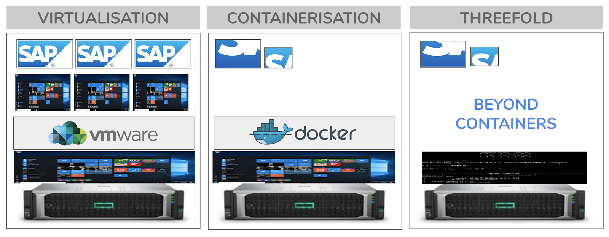

Containerization is the current wave for deploying compute applications. It is more flexible and has big efficiency benefits, but complexity and security remain a big issue. A high level of automation can be achieved but it is a very centralized model where centralized managed applications are the big boss.

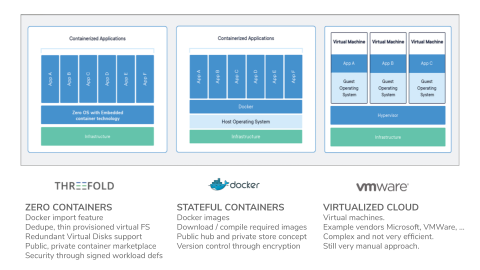

In our Zero-OS, we have eliminated lots of layers and as such we can be much more efficient and we are not dependent on third-party software vendors. Our operating system is not managed by humans. It is an autonomous system which gives you the ability to run any container workload in all safety while achieving more performance and efficiency. Our container technology is compatible with docker, yet still has quite a lot of great benefits.

##  **Storage = Zero-DB**

<table border="0">
  <tr>
   <td>

   </td>
   <td>
    Backend Storage Engine
<ul>

<li>Can do +50.000 transactions per second

<li>Can work on SSD & HD

<li>Optimized for easy (soft/green) operation on HD

<li>Always append store (can keep unlimited history)

<li>Master-Slave replication
</li>
</ul>
   </td>
  </tr>
</table>

0-db is a super fast and efficient key-value store redis-protocol (mostly) compatible, which makes data persistent inside an always append datafile, with namespaces support.

## **Network = Zero-GW and Zero-Net**

<table border="0">
  <tr>
   <td>
    
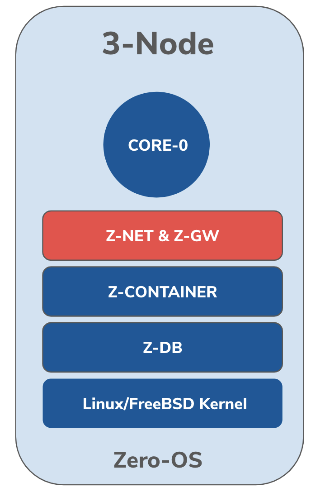

   </td>
   <td>
    <strong>Z-GW = Network Gateway</strong>

Interfaces:
<ul>

<li>VXlan

<li>IPv4/6

<li>Bridge to Public Network

<li>WireGuard

<li>HTTP(S) proxy

<strong>Z-NET =  Overlay Network</strong>

Wireguard based encrypted overlay network between any containers
</li>
</ul>
   </td>
  </tr>
</table>

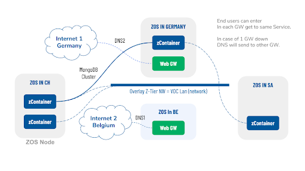

 The Zero-nets are the overlay networks connecting all the containers. They can exit on multiple areas using the gateways. Here we called them web gateways but many types of access methods can be used (e.g. VPN technology or port forwarding). This allows for achieving full network and systems redundancy.

In the above picture, any datacenter or network gateway can fall away, and the solution will still be available.

<!-- tabs:end -->

!!!include:smart_contract_for_it.md

# Architecture

## Structure

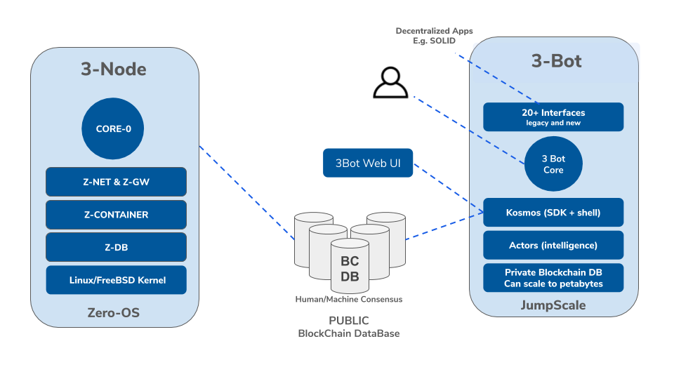

Kosmos is our scripting environment (see jumpscale) which allows you to deploy any workload in a very efficient easy manner. The Kosmos shell is very easy to use and can be installed on any platform.

Kosmos and the Kosmos Actors will create a low-level “workload definition” which gets registered on the blockchain database. After verification by humans and or machines (multi-signature on the BCDB) the Zero-OS will pick up the workload and do the local provisioning.

##  Provisioning Flow 

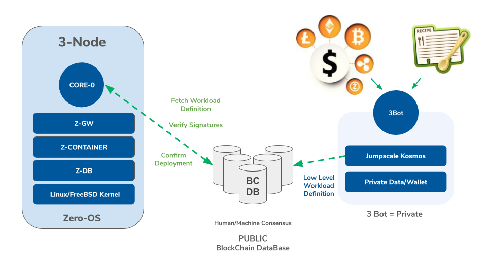

A 3bot has been educated by means of recipes and has an integrated digital wallet. These two resources are needed to be able to deploy any workload in the field.

# JumpScaleX Empowered

JumpscaleX is a cloud automation platform designed for scalability and fast development with a low memory footprint. It does that by providing very easy-to-use SALs (System Abstraction Layers) language which makes development cross-platform very efficient and unified, as well as easily adaptable to technology changes by exposing an abstract interface.

The main components of the jumpscale automation suite are:

<!-- tabs:start -->

### **SAL**
**SAL** System Abstraction Layer – it is a DSL (domain-specific language) for talking to a system. This allows the developer to use a user-friendly human-looking language when developing the life cycle management actors in Kosmos. This is the main bulk of jumpscale.

### **Clients**
**Clients** are user-friendly clients interface help to connect to a multitude of systems (e.g. SSH, GitHub, FTP, Taiga, .. etc). 
*

### **Kosmos Actors**
**Kosmos Actors** Executing the intelligence required to get to full self-healing & self-driving.  Each actor is responsible for managing one or more services and it is the only location where configuration information resides. Think about them as virtual employees being responsible for a certain part of the universe which needs to be automated.
*   **Kosmos Shell: **Shell to interact with the actors.
*   **Config Manager:** A secure way to manage configuration instances. Anything saved to the file system is NaCl encrypted and only decrypted on the fly when accessed.
*   **Executors**: Jumpscale comes with its own executors that abstract working locally or remotely. Including: 
    *   SSH Executor (for remote execution)
    *   Local Executor (for local execution)
    *   Docker Executor (for executing on dockers)
    *   Z-Container Executor (happens over SSH & CoreX)

### **Startup Managers**
**Startup Managers**: Manage running processes in corex, tmux, etc.

### **tools**
**Tools** are there to automate your daily life as an expert IT person.

### **Schema & Data management**
 **Schema & Data management** layers the data strong typing, safety for your data models and all the tooling for data manipulation.

### **Configmanager**

The config manager in JSX provides an immediately-available security layer for configurations. It manages sensitive data, only decrypting during runtime when needed. It also has a recovery system built-in – built to facilitate creating, retrieving, deleting, importing, and exporting configurations.  \

### **Kosmos**

Kosmos is a new way to interface with all of JSX’s tools, SALs, clients, servers and builders. It gives full control over both the functionality and the instances created seamlessly, making building a deployment world and walking around all its components very simple. 

### **Builders**

A big part of deployments is managing built solutions or components, which JSX makes very simple. Using JSX builders, a developer can build, install, and sandbox their solution in no time. They can then create flists, which are lightweight metadata descriptions to be mounted in the filesystem.
<!-- tabs:end -->

# Use Cases
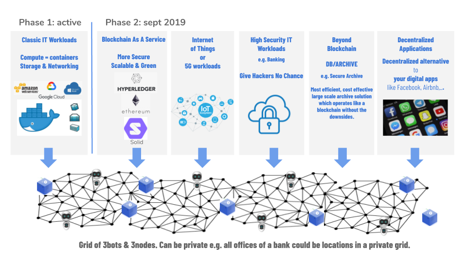

##  Cloud Workloads 

Phase 1 is active today:

*   Docker
*   S3
*   Web gateway = http(s) proxy to any group of containers at the back
*   ZDB service = our own storage service on SSD and HD

+90% of all workloads which can run on Google cloud, Amazon, etc, can be made to run on the ThreeFold Grid.

# Example Packaging

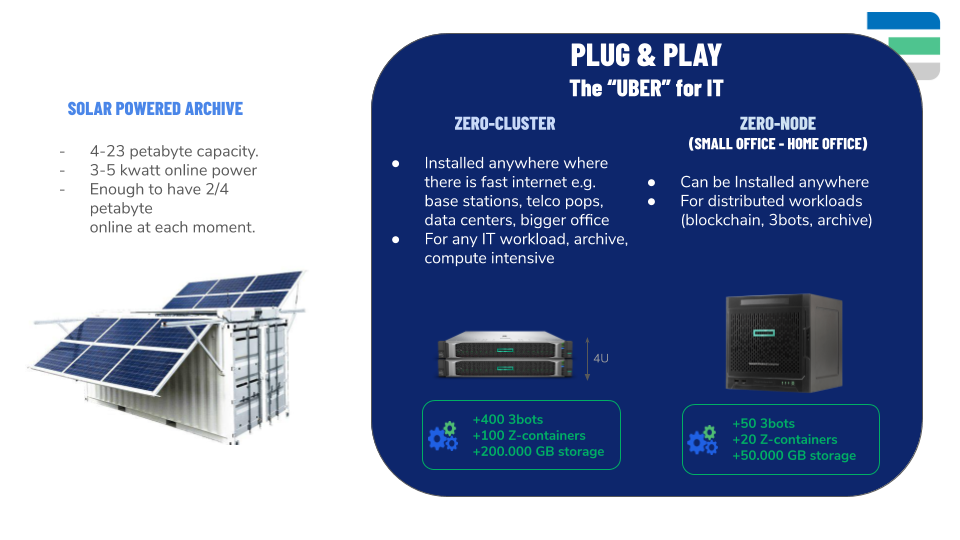

<table>
  <tr>
   <td>
    

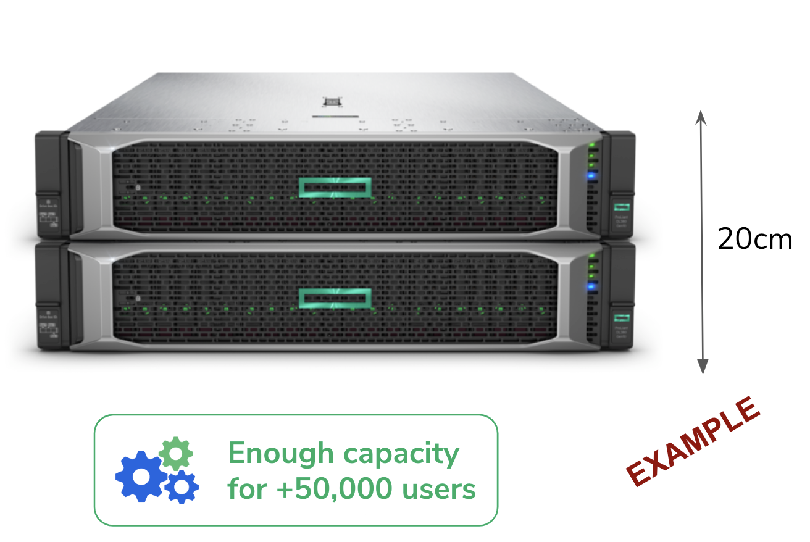

   </td>
   <td>
Min configuration for 2U = 10cm height

 32 core CPU (Intel /AMD)

256GB of RAM

1.9 GB of SSD

96TB of HDD

(Example on the left is for 4U)
   </td>
  </tr>
</table>

<table border="0">
  <tr>
   <td>
    
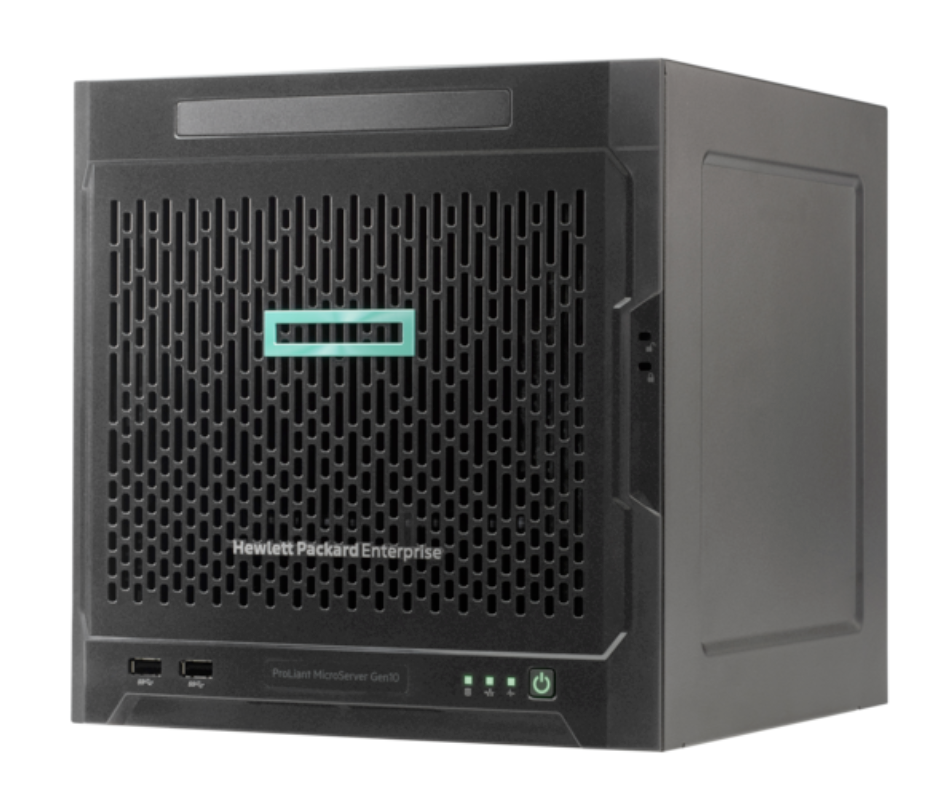

   </td>
   <td>
    
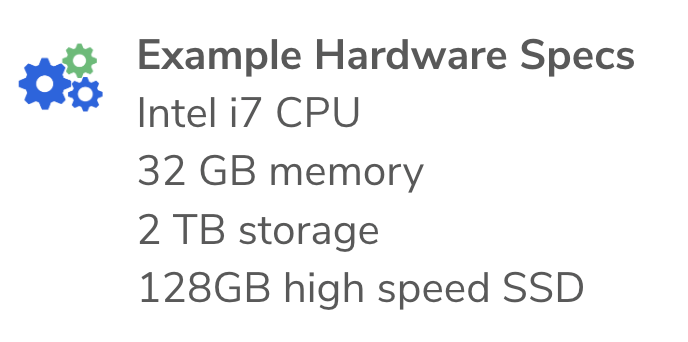

   </td>
  </tr>
</table>

 Threefold Tech is hardware vendor-agnostic as long as it meets the minimum requirements specified above (small box). However, Threefold has partnered with HPE to offer to our farmers certified hardware that runs our technology to generate highly secure certified capacity and is fully supported by HPE.

# Why can we be so efficient?

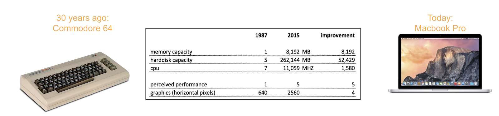

!> **Important** Hardware improved 10,000 times
But, user features and performance improvement improved &lt; 10 times
.. Why?

*   Education: Too influenced by IT vendors, too many abstraction layers
*   Large IT companies: Acquisition strategy forces them to integrate = complex layers 
*   IT startups: Painkiller approach pays off
*   It is easier to build layers on top of other layers instead of rewriting

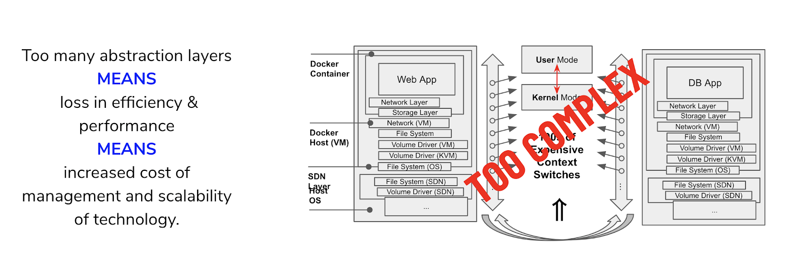

Current information systems are very complicated and the result of years of continuous growth and expansion to meet the ever-growing demand. Organic growth of IT systems results in adding layers of software integrating the old and the new. These added layers of software integrating old and new come at a price - they consume compute and storage capacity without adding additional end-user capabilities. It adds to the overhead of running an IT system creating a lot of context switches for the processors. 

Context switching is the process of storing and restoring the execution state (context) of a process

so that execution can be resumed from the same point at a later time. Each layer of abstraction involves multiple expensive user and kernel-mode context switches. Even a simple network interaction between two applications results easily in hundreds of context switches.

Inevitably this increases the inefficiency of IT architectures just like what happens with us, people,  are disturbed every 5 minutes by a request to do an additional task.

Eliminating layers and using other protocols and patterns to avoid context switches has a huge benefit. This is not the only trick we do – we also work on algorithm layer (e.g. for the storage, see [the autonomous whitepaper](autonomous_layer.md)).

# White Paper Takeaways

1. To deliver the required compute and storage capabilities for the exponential growth in digital services, Information Technology needs to be substantially overhauled so that it can exist everywhere – in datacenters, in homes, in cars, in lamp posts, in mobile masts, without having local or remote administration needs (autonomous).
2. Efficiency gains are mandatory to deliver the exponentially-growing needs. Hardware innovation does not follow Moore’s law anymore and we cannot rely on hardware to fuel the increased needs.
3. A new technology paradigm is needed separating utility (compute and storage) operations from complex application deployments. Compute and Storage need to become the “electricity” that fuels the information age.