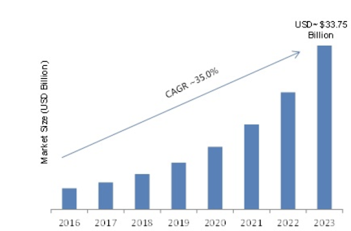

# Edge Cloud not Grid cloud?

The term Edge Cloud or to be more precise Edge Computing is one of the most hyped technology terms of these days. 

## Edge Computing Definition

According to Wikipedia “**Edge** computing **is** a distributed computing paradigm in which computation **is**largely or completely performed on distributed device nodes known as smart devices or **edge** devices as opposed to primarily taking place in a centralized **cloud** environment. 

[https://en.wikipedia.org/wiki/Edge_computing](https://en.wikipedia.org/wiki/Edge_computing)

In summary, this means that the cloud is divided into smaller pieces and moving to the edge. 

## Drivers for Edge Computing

Some latency sensitive applications require fast response times in order to work properly. A good example is self-driving cars. It is obvious that a lot of decisions in autonomous vehicles have to be made instantaneously, the decision on how to react to the unexpected while driving with high speed can not afford to be slowed down by packets travelling long distances to be processed. Eliminating additional hops and any further points of failure increases the reliability of the system. Moving compute as far out as possible to the edge is the logical choice.

In a more generic way  more real world situations are relying on an IT component to be involved in some form of decision making where time is of essence.  The current IT setup is that we have highly concentrated IT setups in data centers connected by fast networks to the rest of the world. This setup is rapidly becoming obsolete as we need to have the fastest possible response for everyday activities which cannot sustain the time delay caused by (long) network connections.  Having actual data processing and storage facilities close to these real world situations is the next evolution of IT capacity.

These thousands of situation are mostly in the IoT area but also other killer applications like streaming would greatly benefit from being served from the edge rather than a distant central location.

## Edge Computing market Facts

Due to the billions of IoT devices driven by various use cases like autonomous driving,  a huge demand for Edge Computing is evolving rapidly. According to the Digital Journal, the Edge Computing market is growing extremely fast. With a  CAGR of over 35.0%  and  the market is expected to  reach  USD 33.75 billion by the end of 2023.

Source: [http://www.digitaljournal.com/pr/3394129](http://www.digitaljournal.com/pr/3394129)

	

Edge Computing and Grid Computing are often used in the same context and sometimes are confused. For the purpose of this whitepaper,we’d like to define the terms going forward as follows: 

Grid Computing means a computer network of 100% distributed computer resources like processing power, memory and data storage of similar or different types to which authorized people have access to in order to run their computation workloads.That means that Grid Compute nodes  are mostly in data centers and may be dispersed over wider regions but are typically still far from the edge. In comparison to Edge Computing,  Grid Computing environments are owned by more than one individual or company, and thus, controlled by many.

Edge computing has risen from a need to have data processing and storage as close as possible to real world situations.  Situations is a generic term used here to describe that it can be something as simple as recoding biometric data by a smartwatch to supporting the required information of making a self driving car do what it needs to do.  The necessity comes from having to have locality in terms of compute and storage capacity - it can be used my multiple use cases (situations) but does not have to.

In this whitepaper we will focus specifically on edge computing and see what  is required to make that work in the best possible way.  However we will see that there is a link back to grid computing at the end of the paper.

## The Benefits of Edge Computing

Edge computing come with specific benefits that are mandatory to make the next evolution in the IT industry work.  We have optimised the central model to such a degree that going forward the network, which connect central capacity to use cases in the field, the next bottleneck.  Edge computing is solving a number of challenges faced by real world situations by the following benefits:

### Speed

**Speed** is probably the most important benefit of edge computing, as there are plenty of use cases that require near real time computing.  

### Scalability

The scalability of edge computing also makes it incredibly [versatile](https://www.vxchnge.com/blog/edge-computing-use-cases). By partnering with local data centers further out on the edge, companies can easily target desirable markets without having to invest in expensive infrastructure expansion. Edge data centers allow them to service end users efficiently with little physical distance or latency. They also do not constrain companies with a heavy footprint, allowing them to nimbly shift to other markets should economic conditions change.

### Availability and Security

Traditional cloud computing architecture is by definition centralized, which makes it especially vulnerable to [distributed denial of service (DDoS)](https://www.vxchnge.com/blog/how-to-protect-data-centers-from-a-new-generation-of-ddos-attacks) attacks and power outages. Edge computing distributes processing, storage, and applications across a wide range of devices, nodes and data centers, which makes it difficult for any single disruption to take down the network which is why logically and geographically dispersed systems are often used for DDoS mitigation like in Content Delivery Networks (CDN)

By pushing everything to the cloud, you’re leaving your business open to ISP failures and cloud server downtime. Many mission critical operations like railroads and chemical plants won’t even use the cloud today. Their own server farms are the only way to guarantee uptime.

### Process optimisation

Another big benefit is process optimization. If self-driving cars were to use the cloud instead of the edge, they’d be pushing all the data they gather up to the cloud. But if the edge makes local decisions, the cloud may not need all that data immediately – or even at all.

## Requirements for Edge Computing

When we want to allow compute and storage capabilities to exist at the edge we need to overcome a number of challenges that distributing this capacity presents.  Most traditional IT technologies do not allow for this as they have been built to live in large datacenters where there is a lot of “care” for these technologies.

The largest generic hurdle to overcome is that at the edge there is going to be a lot less “care” for the technology to rely on.  These “devices” have to be self sufficient to a large degree.  If we want to sum up some of the specifics of edge technology this would come out:

*   A typical edge device or node must run an OS which comes in at a low cost or ideally for free like some of the open source offerings. This enhances proliferation of capacity at the edge. 
*   Container technology must be embedded in the OS at the lowest possible level to  create the maximum benefit of efficiency from the edge hardware: classic Virtual Machine environments are just to inefficient and resource consuming for edge use cases. There will be Virtual Machine based edge solutions but these are going to be out there for a certain period of time, catering for current IT workloads to move to the edge.  The true move for the edge can only happen when traditional IT applications are broken up into pieces which require a lot less capacity to run.  Hence is will convert over time to container technology.
*   Edge Computing hardware will consist of datacenter grade hardware and all sorts of other types of hardware.  The edge might include some smaller sized data center facilities but will for sure also include other types of “homes” for compute and storage equipments.  Think of transportation as a specific use case - capacity on seafaring vessels, capacity on trains, capacity in vehicles.  Hardware will have to accomodate different use cases,  price levels, formfactors and power consumption. 
*   Edge hardware needs a lightweight OS which is very close to the hardware components to get the maximum compute and storage capacity out of it.  No need for all sorts of fancy user interfaces - for REAL edge capacity there will be no ways for local people to interact with this piece of edge capacity - one further step into the edge computing development there will be no mode need to have remote people access to these devices for maintenance purposes.  The ultimate edge computing solution will have a large amount os self sustainability - where there are no longer technically schooled people required to keep the capacity available and up and running.
    *   Edge means in most cases being remote and having no access to humans or humans are simply too expensive for the specific use case. 
    *   System failures will be caused by power outages and/or no network availability. The ideal OS to deal with this no people, zero touch  approach should  be stateless and needs to have self healing capabilities which are run by automation software robots

## Existing Edge Computing Solutions

Today there are a few Edge Computing platforms out there which cover some requirements as outlined above. 

*   Microsoft for instance launched products like Azure IoT Edge and Azure Data Box Edge to extend their Datacenter based Azure cloud offering to the edge. 
*   Another attempt to bring a centralized cloud technology to the edge is the Openstack edge computing initiative which is in concept phase only so far. 
*   An interesting OS for the edge is CoreOs also known as Container Linux which runs on nearly any platform whether physical, virtual, or private/public cloud.
*   The more recently there are a few blockchain driven technologies out there that are pushing for edge capacity to exists.  Examples are:
    *   [SIA](https://sia.tech/)
    *   [Somn](https://sonm.com/)
    *   [Filecoin](https://filecoin.io/)
*   Content delivery networks that have a lot of “capacity” sitting close to end users are expanding their capabilities beyond content delivery
    *   [Limelight](https://www.limelight.com/products/iot-and-edge-cloud/)
    *   [Akamai](https://www.akamai.com/)

## The holy grail

The holy grail would be a self healing edge grid. Edge because of all the benefits Edge Computing brings to the user: Speed, Scalability, Reliability, Security, Versatility, and Process Optimization. Grid because it fulfills the distributed workload requirements a classic centralized cloud would normally be used for without the central nature and all its disadvantages.

Probably the most important part of the ideal solution is self healing. The biggest challenge of an Edge Computing environment is the dependency on local care: humans to maintain hardware and upgrade or fix software components. Self Healing needs to do the job here which means zero people can be involved. 

Only a self healing mechanism with zero-people involved, completely decentralised brings down the cost and provides more security to the environment and makes it highly scalable. See our specific [Whitepaper: Zero People IT Is The Future](zero_people_it_is_the_future.md) on this topic

Some of you may think the new blockchain based technologies like SIA, Filecoin or Somn may be the holy grail. But they are not.

Their implementations are in most cases to slow and that’s why it does not really make sense to use them for production purposes. Another downside is the complexity of the implementation caused by stitching together 3rd party technologies. Plus in many cases these blockchain based technologies are very early stage with beta implementations or even roadmap only type of technology.

The holy grail is something that has not been done before, it needs to be a versatile systems that is able to self manage.  The capacity should not be owned by a large global conglomerate - it should be owned by many and therefore it should have a commercial model where people individually can decide to partake in building this global edge solution and where there is a defined return of investments for those partakers.

There are a few groups of people trying to make a decentralised solution for this, owned by many, creating services for all.