# ThreeFold Technology Whitepaper: Technology Overview
Author: Kristof de Spiegeleer
Version: 1.1
<!--- TODO: Get link to redirect to MDbook wiki 
Url: [http://techoverview.threefold.io](http://techoverview.threefold.io)
-->

## Introduction

The goal of this document is to provide an end-to-end overview of the ThreeFold technology suite and its components. Please do not forget to read the two white papers mentioned below – they explain in more detail the capacity and autonomous layers. Of the three technology layers, the experience layer is yet under development and only available for early adopters.

Please do not hesitate to give us feedback. For us, the technology is now so natural that it is hard to see how this all comes across to a reader who has never heard about it. Any feedback would be very much welcomed. Thank you!

# Decentralization Is Necessary

## Future IT Workloads Demand Decentralization

The current digital world is built around centralized infrastructure and datastores. We have been educated to store value in central places as that allows for "perimeter" security similar to how we secured money in large bank vaults.  However, the world has changed and storing everything in central locations is no longer viable, as it causes massive data replication.

We need to move to a model where the data stays close to where it is created and is not moved to central storage locations that enable remote access. The traditional model has allowed us to innovate and control costs over the last two decades but will not fuel/allow for innovation in the next decade.

For innovation to excel going forward, we need to decentralize the compute and storage model to allow an exponential increase in data generation to happen, while retaining the reliability of data, and making sure that the security model around all of this data is good enough to keep out the bad people.  

Also, with the exponential growth of data creation, we need to be much more aware of the effectiveness and sustainability of the compute and storage model. 

These points are illustrated in the infographic below.

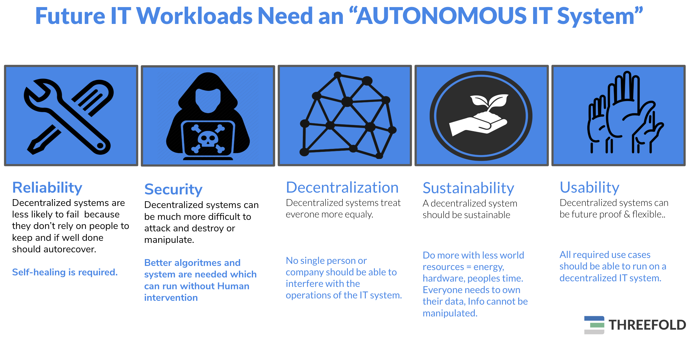 **Current Information Technology is very Centralized**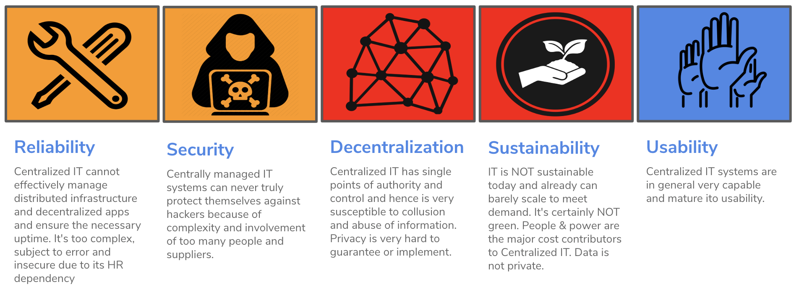

The current centralized infrastructure cannot deliver on the required items to support the exponential growth of compute and storage requirements.

For reliability of such infrastructure, the current model of deploying infrastructure and applications is too complex. Many people are required to build simple setups and it is very easy to make mistakes leading to a lower-than-required reliable setup. Same thing for security – it is mind-bogglingly complex to manage a four football field sized datacenter and all its technology

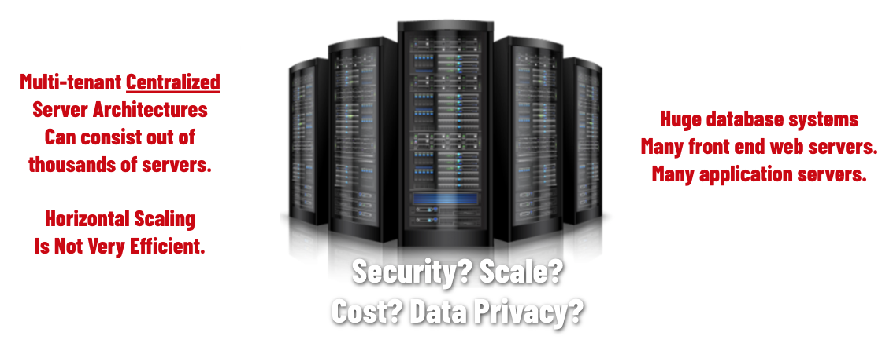

**Is Blockchain up to the Challenge ? **

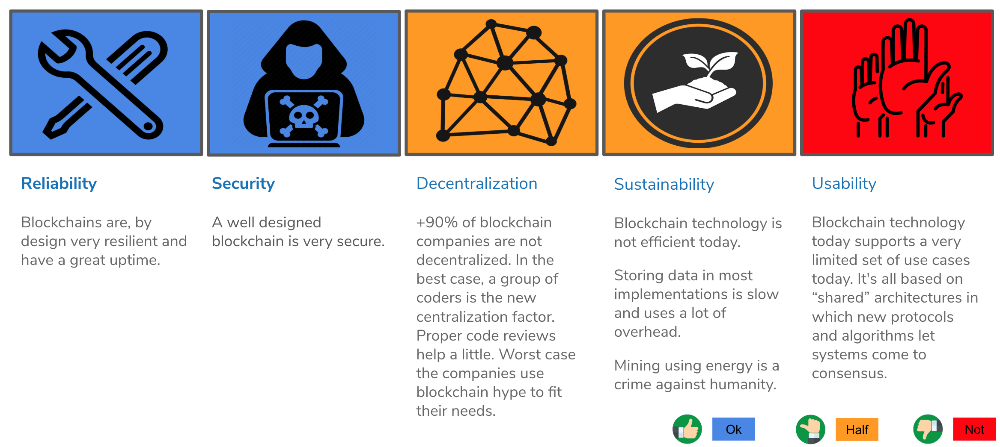

A newcomer in the IT space has been the rise of blockchain technology. Blockchain technology is seen as technology that can improve on the delivery of decentralized compute and storage capacity – but can it? Looking at the same aspect of what needs to improve for this exponential growth in data creation and storage, it certainly delivers on certain aspects, but does not cover all of the requirements. Two to mention are that most blockchain technologies: 1. are far from sustainable and 2. certainly not usable by all of us they require a certain amount of "nerdiness" to be able to drive and interact with them.

## ThreeFold Paradigm Shift: Serverless Circular Architecture

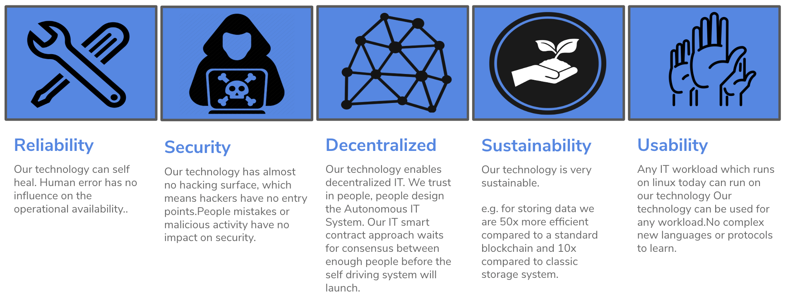

TheeFold Tech has invented a new paradigm for Information & Communication Technology. A purely centralized approach is not desirable – neither is replicating data and compute processing 100 times. 

The solution: every person or organization becomes the center of their digital life. Each entity gets a digital avatar (a.k.a. 3Bot)  which is responsible for all data storage & processing and yet offers interfaces to allow any app to work with it. 

The result is a dramatic improvement in security, efficiency, and cost. There is virtually no limit of scale to this approach. To allow the 3Bots to exist, a self-driving, self-healing IT system had to be created.

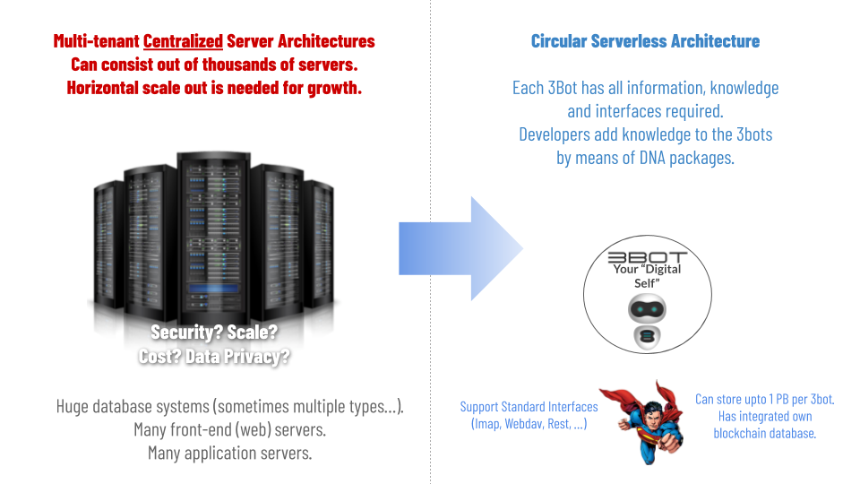

# The ThreeFold Layers

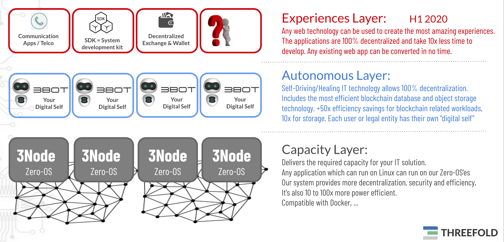

## Capacity Layer

**Delivers the required capacity for your IT solution.**

**Any application which can run on Linux can run on our Zero-OS’es.**

**Our system provides more decentralization, security, and efficiency.**

The capacity layer is the layer where CPU and Storage resources are delivered. It consists of hardware (storage/compute servers) and the TF Tech operating system called Zero-OS.

Zero-OS nodes are installed wherever capacity is required (e.g. at a base station for 5G applications, etc). Zero-OS has been designed from the bottom up. TF Tech started from a Linux kernel and secure boot BIOS – everything else in the operating system has been created from scratch. It delivers 3 primitive functions: storage capacity, compute capacity in the form of highly-optimized containers, and network capacity for running the network services.

This layer has no self-driving or self-healing capabilities – it is a layer of smart, efficient, and secure algorithms created with as little code as possible. The fewer lines of code the more security.

## 

## Autonomous Layer

**Self-Driving and Self-Healing IT technology allows 100% decentralization.**

**Includes the most efficient blockchain database and object storage technology.**

**+50x efficiency savings for blockchain-related workloads, 10x for storage.**

**Each user or legal entity has its own "digital self."**

TF Tech’s solution allows for self-driving and self-healing workloads. This is possible because of an innovative decentralization technique. Each user or organization (e.g. company or department of the company) gets a digital avatar which we call a 3Bot. Example: each user in the 5G network will have his or her own 3Bot in complete safety and data privacy. The 3Bots are all registered on a modern type of phone book implemented using blockchain technology. This phone book allows all 3Bots to talk to each other (find each other) while securing communication (verify incoming traffic on authenticity and correctness). All these 3Bots run autonomously in the network created around them and in the base stations. There are no people involved to run this network and keep it operational. This is a very different way of thinking – it leads to much more security, efficiency, and higher performance. More specifically, this will lead to huge network savings and makes building large scale datacenters obsolete. The 3Bots know how to deploy IT and network capacity as required by the user or the company (self-driving) and they can also auto repair issues (self-healing). As an example, this technology can be used to implement any network service as required by a 5G operator.

## Experiences Layer: from appcentric to experience centric.

**Autonomous Decentralized Experience Layer.**

**Any web technology can be used to create the most amazing experiences.**

**The result is 100% decentralized and any experience developer need 10x less time to develop.**

The grid of 3Bots allows any experience to be developed with much more efficiency. With only two numbers, all information in the world can be addressed. The security is higher – for blockchain workloads, up to 50 times more network and storage efficiency can be achieved. The 3Bot API allows any chosen web technology (JavaScript frameworks) to very easily connect to the 3Bot for all backend services. This enables very easy creation of experiences (apps) for the 5G operator and end-users. This experience layer is delivered in the form of an SDK (System Development Kit) and has a lot of components pre-made like decentralized authentication, identity management, identity verification, video and audio conferencing, object storage, browser security (secure audited browser in browser technology), email services, and more.

# Is ThreeFold Technology 100% autonomous today?

Does a 100% autonomous IT system exist today? To our knowledge, the answer is **no**. At ThreeFold, we are not there yet, **but we are very close. We believe we are further advanced** compared to any other startup or technology vendor in this space. To achieve what we have to date, we had to reinvent a blockchain, an operating system, and a self-healing autonomous IT system – none of which are small feats.

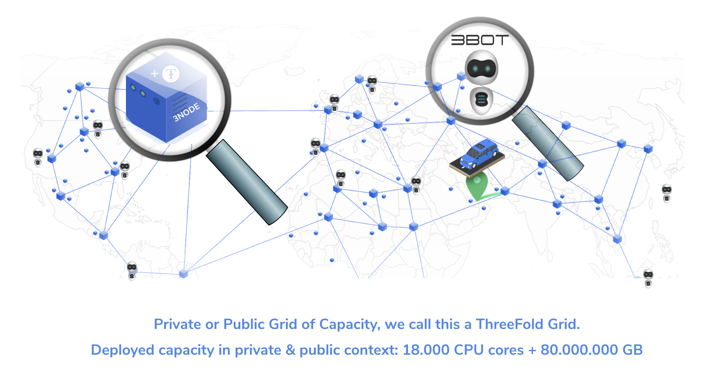

**We are very close**

Our Zero-OS & Zero-Chain is usable and deployed today. The ThreeFold Grid is the first deployment of this unique technology and has been activated Q2 2018.

There are more than 15.000 CPU cores and +40.000.000 GB of storage activated with this technology.
<!--- TODO: update capacity map --->
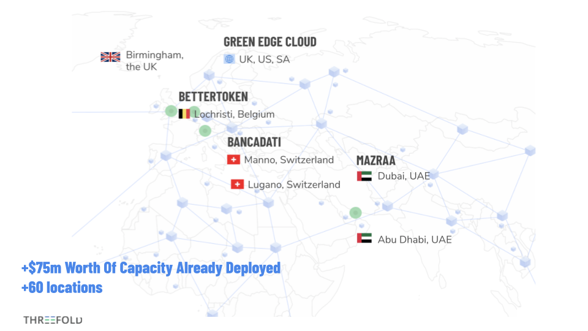

The capacity layer is available since Q2 2019 in test, production Jan 1 2020. 
This layer allows anyone to use the grid as decentralized alternative to existing clouds. 

Through a blockchain you define the workloads you want and it becomes reality.  The large majority of workloads running on existing clouds can run on on our TF Grid today.

The Autonomous layer is next and available for early adopters.

# Technical Components

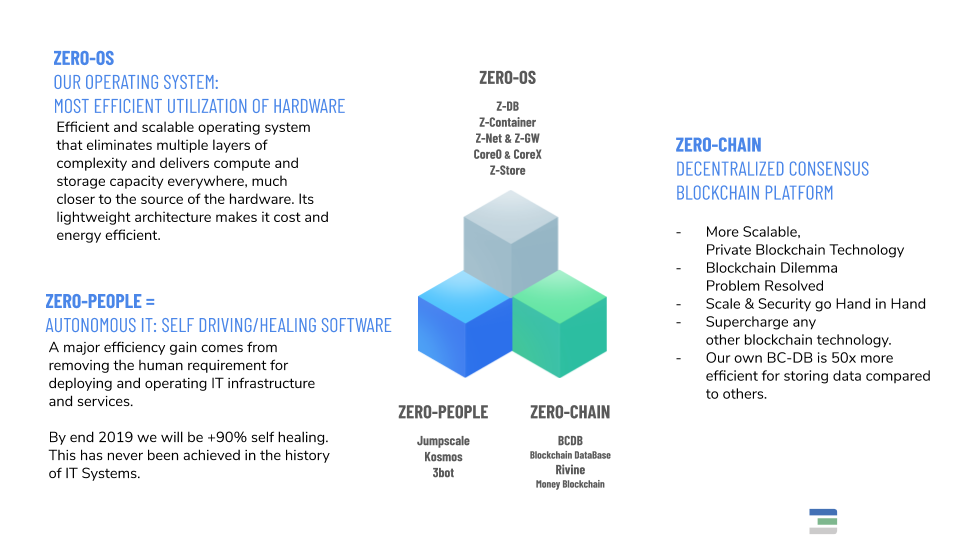

## Zero-OS as the operating system for all workloads

Zero-OS is a minimal operating system serving one single purpose: to make the hardware available to the autonomous layer. Zero-OS is a stateless operating system and is not installed on a storage device in the server. At boot time, the needed binaries and config files are made available over a secure network connection. The zero-footprint locally on the server simplifies administration work needed for these servers, enabling these servers to live anywhere.

In Zero-OS, the number of active components and therefore the complexity of the operating system has been brought down to the absolute minimum, making maximum execution capacity available to real-world use cases and applications. 

Read more about the Zero-OS in [our capacity white paper](capacity_layer.md)

## 3Bot = Your Digital Self

3Bot is the intelligent virtual alter ego which manages everything in our digital life, or the digital life of our company. The 3Bot makes it possible to run workloads in a fully autonomous manner.

Features

Identity Information
Autonomous DAPPS SDK
Serverless Core
Email, chat, contacts, calendar
Speaks to all legacy interfaces
Up to petabytes of storage per 3Bot
Video / Images
Documents
Structured Info (DB records)
Browser In Browser (through opensource Jimber)
FinTech Functionality
Ultra Secure Wallet
Decentralized Exchange
Your Digital Life = Decentralized Apps
E.g. Social Media
Decentralized Video Conference System
Your Virtual IT System Administrator

Read more about the 3Bot in [our autonomous white paper](autonomous_layer.md).

## Jumpscale X: The automation platform which makes the 3Bot possible

Jumpscale is an automation framework written in Python. It has been developed for more than a decade and originates from an automation product which was acquired by SUN Microsystems from Q-Layer, which was one of our previous companies. Our newest release is version 10, called JSX.

Jumpscale is the foundation for the autonomous layer. To get to autonomous operations, IT experts have to model IT architectures. These models have to describe all the components involved in creating the architecture (e.g. a container running a webserver, a container running a database server, and then all the required network paths between these two containers and the rest of the world). Once this description is complete and tested, it can be given to the autonomous layer which launches, monitors, and operates the architecture. Hence, autonomous IT.

## BCDB = A Beyond Blockchain Database

This is a highly-capable database (scalable, secure, etc.) incorporating all the features of modern blockchain technology.

The blockchain database (BCDB) is a super-efficient database that uses blockchain technology to securely store and retrieve data. Blockchain principles like "always append" and “store data in an immutable manner” are key aspects of this database technology.

The blockchain database is used in the autonomous layer for storing information of users, farmers, the digital representatives (3Bots), IT Architecture descriptions, and the state information of these running applications. This database technology provides distributed storage of key information of the autonomous layer.

For a 100 node deployment, our BCDB will be **50x more efficient **compared to other blockchain technologies for storing data from a storage and network perspective.

The BCDB is used in the 3Bot which means every user has his or her own Blockchain DataBase. A BCDB can also be used as a shared ledger between multiple people.

This technology component alone is significant enough to grow a big startup business on its own. Read more about the BCDB in [our autonomous white paper](autonomous_layer.md).

## Rivine as blockchain for digital currencies

We believe the current way that blockchains are created does not make them very suitable for data storage. That is why we have created the BCDB. We believe though that this type of technology is ideal as a store of value – in other words, serve as a digital ledger for digital currencies.

We have built a new type of blockchain which is more efficient than most other blockchains. It does not require mining and is a blockchain specifically designed to be very efficient at storing value.

Any user of our solution can deploy his or her blockchain in a matter of minutes, and by doing so, we have resolved the blockchain dilemma.

Read more about Rivine and the blockchain dilemma in [our autonomous white paper](autonomous_layer.md).

## Zero-Store

The Zero-Store technology contains all the logic to store data in a reliable and effective manner over multiple devices in multiple geo-locations. Embedded in the software are basic storage primitives to process data before sending it to distributed devices, which are aimed at increasing the performance of searching, finding data, and securing data.

* **Chunking:** makes large datasets indexed and cut into smaller organized data chunks, improving access and search speed.

* **Compression:** makes data storage use less physical storage by passing it through an algorithm that compresses the data volume.

* **Encryption:** creates unreadable data for the people or processes that do not have the (proper) key to decipher the information.

* **Disperse:** storage in such a way that data becomes 100% secure and cannot be retrieved from one site alone. It also allows you to retrieve your data when some of the storage nodes are offline.

All of these primitives are configurable and you can decide how data will be processed (optimized) before being sent to the distributed storage devices → the zero-databases. This makes dispersed storage a very reliable and performant storage solution without compromising effective use of physical storage capacity. 

Read more about our storage system in [our autonomous white paper](autonomous_layer.md).

## Zero-DB

A highly-optimized storage technology which uses physical storage media like SSD or HDD. The technology has dedicated management processes per physical storage device, ensuring optimized usage parameters to maximize performance. 

Zero-DB technology is characterized by the following aspects:

* Backend Storage Engine

* Can do +50.000 transactions per/sec

* Can work on SSD & HD

* Optimized for easy (soft/green) operation on HD

* Works with reservations

* Always append store

* Can keep unlimited history

* Master/Slave replication

## CORE-0 and CORE-X

**Core-0**

We call Core-0 the combination of all the low level components of Zero-OS. Each component is responsible for a part of the logic handled by Zero-OS when exposing the hardware capacity (storage, compute, and network) to the higher layers. 

**Core-X**

Is the process manager for an individual container. Because of the secure nature of the 3Nodes, a direct connection from a user to a node is not possible, but Core-X allow users to connect to their own containers and manage the processes inside. It has a web interface as well as a REST interface. So, the containers can be managed both manually and programatically.

# Integrated Technology

The 3-layer technology stack provides a very flexible, efficient, and powerful setup to create and run many different IT workloads. The components are available to be used in specific setups, creating a large number of actual use cases.

The capacity, autonomous, and distributed application layers are created by combining and integrating all of these technology components.

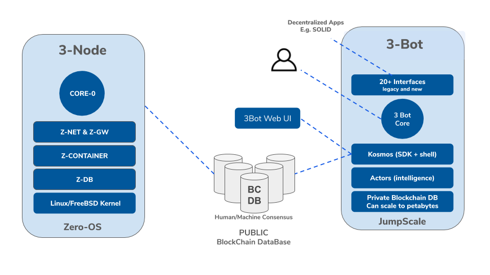

# Our 6 Point Smart IT Program

Our aim is to make your IT platform a "profit" center rather than a “cost” center. For this we believe a decentralized IT solution is the best way. IT technology providers have created technologies that are hard to install, manage, operate, and upgrade, which creates a necessity for experts to be trained, involved in, and constantly administering and supporting your IT infrastructure. Unless this dynamic is addressed, IT will always remain a cost center to your business. 

We intend to shift this dynamic and change the status quo through our **Autonomous IT** approach, an approach where your applications and digital workloads are able to install, maintain, and operate themselves, independently. 

The following 6 point program intends to improve your IT environment.

## Be more cost-effective (at least 2x better)

Our **Autonomous IT****_ _**system delivers IT that is self-driving and self-healing. This system requires a lot less hardware and has no dependency on any third-party software vendors. This system can reduce your annual expenditure on IT by at least 2X.

## Be more sustainable (at least 3x better)

Our **Autonomous IT **system delivers IT that is far more sustainable. We offer improved sustainability by:

* Using upto 3x less hardware for the same output. 

* Using hardware at least 2x longer while maintaining good performance..

* Having capacity everywhere, local to where the users are: this reduces network requirements and can even improve security;

* Using new algorithms (e.g. for blockchain and storage) which have dramatic efficiency improvement;

* Re-using hardware where possible – let's not throw away.

For storage we are 10x more "green." For blockchain workloads we can be up to 50x more sustainable.

## Be more secure (at least 10x better)

Hacking has become a part of life and is almost impossible to avoid in the current IT systems. The current IT systems are too complex and require too many people to operate. This results in less security which results in lots of security breaches. 

Most governments do not even know how often they have been hacked and it is a fact that a lot of backdoors are in their systems already today, simply waiting to be used by hacking groups. The only way to really address this security challenge is by making an IT system that is truly autonomous and with considerably fewer lines of code and significantly fewer components. The fewer components there are and the fewer people required to keep a system up and running, the safer it will be.

## Be in control 

Every large organization today is very dependant on many IT providers for the IT systems they require. These systems are often very expensive and complex to operate, and expensive maintenance programs are often required. Many of these systems have been designed to lock in their customers as much as possible and in no way encompass open standards. 

What if there were an IT system where:

* Every software component were understood and 100% owned by local teams (up to code level), and could be maintained & improved by local teams?

* Source code were available for these local teams? Where there was nothing closed source and no modules were used which were not fully understood and audited?

* These local teams would build out advanced IT expert knowledge for the country and many positive spin-offs could have a good impact on economic growth?

* The user were in total control – every user owned his or her own data – this, without losing the requirement for a government to make sure that no malintent were at stake and data could be audited?

## Be the future

We want this system to be 100% future-proof. It is not our intention to copy what is already available in the IT industry today. The goal is to leapfrog the industry with a system that is able to support the applications and workloads of the future.

No more complex upgrades or re-installs. The system is dynamic and constantly adapts in line with future requirements.

## Be complete, avoid complex integration efforts

A government does not want to have to deal with 100+ systems and large teams of consultants required to integrate these systems. There is frankly no reason why current systems are so extremely complex. Our decentralized 3Bot system does not need integration – it is integrated by design, no other glueing systems are needed.

# Open Source

All our code is dual licensed. 

* Free: which means all code is open source but there is no support provided.

* Paid: commercial license, quality checked certified builds with support and training.

All our code is available on [GitHub](https://github.com/threefoldtech).

Main:

* [0-core](https://github.com/threefoldtech/0-core): The core of Zero-OS which is the Zero-OS replacement for systemd

* [core-X](https://github.com/threefoldtech/corex): Process manager for containers

* [0-db](https://github.com/threefoldtech/0-db): A super fast and efficient key-value store redis-protocol with fast indexing

* JumpscaleX: Cloud automation framework. Home for BCDB, config management, kosmos, composed of : 

    * [JSX Core](https://github.com/threefoldtech/jumpscaleX_core)

    * [JSX Builders](https://github.com/threefoldtech/jumpscaleX_builders)

    * [JSX Libs](https://github.com/threefoldtech/jumpscaleX_libs)

    * [JSX Extra Libs](https://github.com/threefoldtech/jumpscaleX_libs_extra)

    * [JSX WebLibs](https://github.com/threefoldtech/jumpscaleX_weblibs)

* [3Bot](https://github.com/threefoldtech/jumpscaleX_threebot): All the 3Bot needs, including server racks with multiple backend implementations

* [rivine](https://github.com/threefoldtech/rivine): Blockchain technology for creating custom chains

* [0-flist](https://github.com/threefoldtech/0-flist): Tool to create and manage flists. The flist file format creates a small file with enough information to make a complete filesystem available without the data payload itself

* [Cockpit](https://github.com/threefoldtech/tf_cockpit): Tool for personal management and farming on TF Grid

Supporting Tools:

* [0-fs](https://github.com/threefoldtech/0-fs): The storage layer of our container technology

* [0-initramfs](https://github.com/threefoldtech/0-initramfs): All that is needed to build the Zero-OS-kernel and initramfs to start root filesystem

* [0-bootstrap](https://github.com/threefoldtech/0-bootstrap): This web service provides dynamic construction of iPXE scripts for booting and bootstrapping Zero-OS kernel images

* [0-hub](https://github.com/threefoldtech/0-hub): Everything needed to serve, upload, merge, and manage flists, as well as convert docker images to flists

* [Openpublish](https://github.com/threefoldtech/openpublish): dynamic lapis-based wiki server 

* [flist-builder](https://github.com/threefoldtech/flist-builder-config): autobuilder config template

* [rivine-chain-explorer](https://github.com/threefoldtech/rivine-chain-explorer): Explorer on the Rivine blockchain

We do realize it is still very difficult today based on the repos alone to get started. The documentation is by no means complete and it still requires a lot of knowledge to get started without help.

# More Information

**Linked information**

* [White Paper: Capacity Layer](capacity_layer.md)

* [White Paper: Autonomous Layer](autonomous_layer.md)

* [ThreeFold Whitepaper 1.0.4](tf_whitepaper_104.md)

**More ThreeFold Whitepapers**

* [White Paper: The Blockchain Dilemma Problem](blockchain_dilemma_whitepaper.md)

* [White Paper: Bringing Trust is a Human Mission, Not a Blockchain One](bringing_trust_is_a_human_task.md)

* [White Paper: Grid or Edge](edge_cloud_not_grid_cloud.md)

* [White Paper: IT Systems Without People Involved Are the Future](zero_people_it_is_the_future.md)

